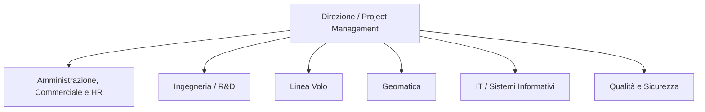

````markdown
## 2. Analisi organizzativa

### 2.1 Modello organizzativo

DigiSky è una PMI innovativa caratterizzata da dimensioni contenute, con un organico che si attesta su una decina di dipendenti. A causa di questa dimensione e dell'alta specializzazione tecnica richiesta dal settore aerospaziale, il modello organizzativo adottato è di tipo **funzionale e "piatto" (flat)**.

L'azienda è strutturata in dipartimenti specializzati per funzione (Linea Volo, Geomatica, Ingegneria, Amministrazione), ma la catena di comando è estremamente corta. Questo modello garantisce un'elevata flessibilità operativa e una comunicazione rapida tra i reparti, elementi fondamentali per gestire commesse dinamiche come i rilievi aerei o i test avionici. Tuttavia, come emerso dall'analisi del sistema informativo, l'eccessiva informalità nella comunicazione e l'assenza di workflow automatizzati possono generare colli di bottiglia nel passaggio di consegne tra le varie unità.

### 2.2 Organigramma

Data la struttura funzionale dell'azienda, l'organigramma si sviluppa orizzontalmente sotto la direzione generale. Di seguito è riportata la struttura logica delle divisioni aziendali:



> **Nota:** inserire qui l'immagine dell'organigramma se richiesta in un formato specifico.

### 2.3 Unità organizzative principali

Le attività di DigiSky sono ripartite tra diverse unità organizzative, ciascuna con compiti ben definiti all'interno della catena del valore aziendale:

- **Direzione / Project Management:** ha il compito di definire le priorità strategiche dell'azienda, gestire i rapporti di alto livello e coordinare le commesse. Monitora i costi, la redditività dei progetti e lo stato di avanzamento delle attività.

- **Amministrazione, Commerciale e HR:** gestisce l'anagrafica dei clienti, l'elaborazione di offerte e preventivi, la fatturazione, la contrattualistica e la documentazione del personale (cedolini, attestati).

- **Linea Volo (Operatori di volo):** è il reparto puramente operativo sul campo. Si occupa della pianificazione tecnica delle missioni, dell'esecuzione fisica del volo tramite droni o aeromobili e della raccolta dei dati grezzi tramite sensori.

- **Geomatica (Elaborazione dati):** è il cuore dell'elaborazione post-volo. Il team prende in carico i dati grezzi raccolti dalla Linea Volo e, tramite workstation ad alte prestazioni e software specifici, esegue mosaicizzazione, ortorettifica, controllo qualità e produzione degli output finali (es. mappe 3D, report tecnici).

- **Ingegneria / R&D:** si occupa della progettazione avionica, della realizzazione di componenti su misura (tramite software CAD 3D) e del supporto tecnico per i test in volo di nuovi sistemi e tecnologie.

- **IT / Sistemi Informativi:** in DigiSky non esiste una divisione IT numerosa e distaccata; la gestione dell'infrastruttura (NAS, cloud, backup) e dell'integrazione software è gestita in modo trasversale da figure tecniche specializzate che si occupano del supporto operativo aziendale.

- **Qualità e sicurezza:** gestisce le procedure, i verbali, le certificazioni operative (come quelle EASA) e controlla che i flussi di lavoro rispettino le normative vigenti.

### 2.4 Attori coinvolti nel progetto

In relazione al processo oggetto di analisi (il **Processo di acquisizione ed elaborazione dati con drone**), gli attori e le unità organizzative direttamente coinvolte nella trasformazione verso il sistema **TO BE** sono:

- **Personale Amministrativo / Commerciale:** coinvolto nella fase iniziale di ricezione della richiesta, registrazione della commessa e, nel sistema TO BE, nell'utilizzo del sistema documentale per l'archiviazione dei contratti.

- **Operatori della Linea Volo:** direttamente impattati dal cambiamento tecnologico in quanto responsabili dell'upload remoto dei dataset grezzi sul nuovo cloud object storage subito dopo l'acquisizione.

- **Tecnici di Geomatica:** attori centrali che dovranno interfacciarsi con il nuovo database PostgreSQL/PostGIS per il tracciamento dei metadati geografici e con il NAS locale riposizionato come cache per le lavorazioni.

- **Responsabili IT / Sistemi:** incaricati di implementare e manutenere la nuova infrastruttura ibrida, gestire le policy di lifecycle dello storage cloud, i permessi IAM e i backup.

- **Direzione / Project Manager:** utilizzatori finali delle nuove dashboard di Business Intelligence (Metabase) per il monitoraggio in tempo reale dei costi di storage e dello stato delle commesse.
````
