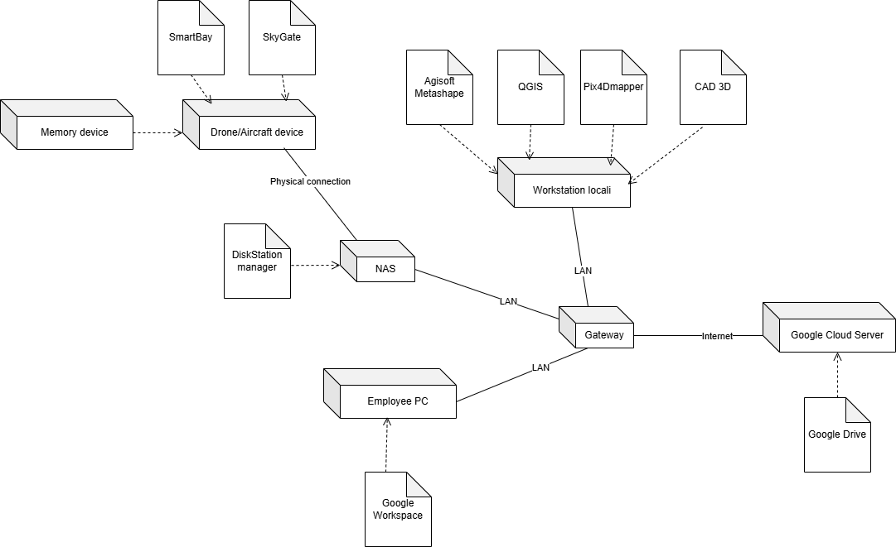
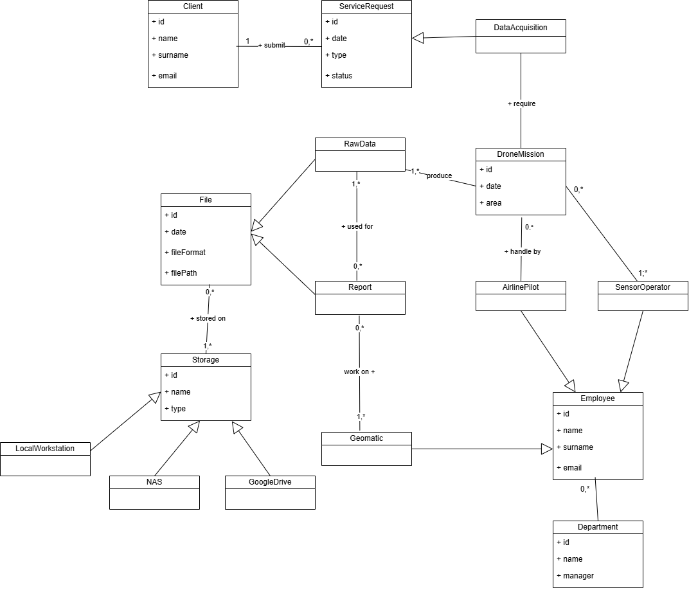
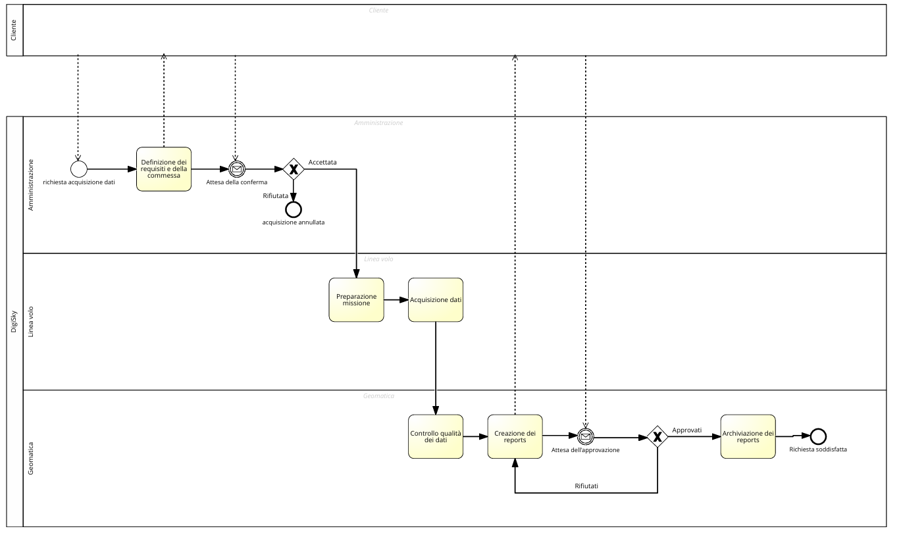
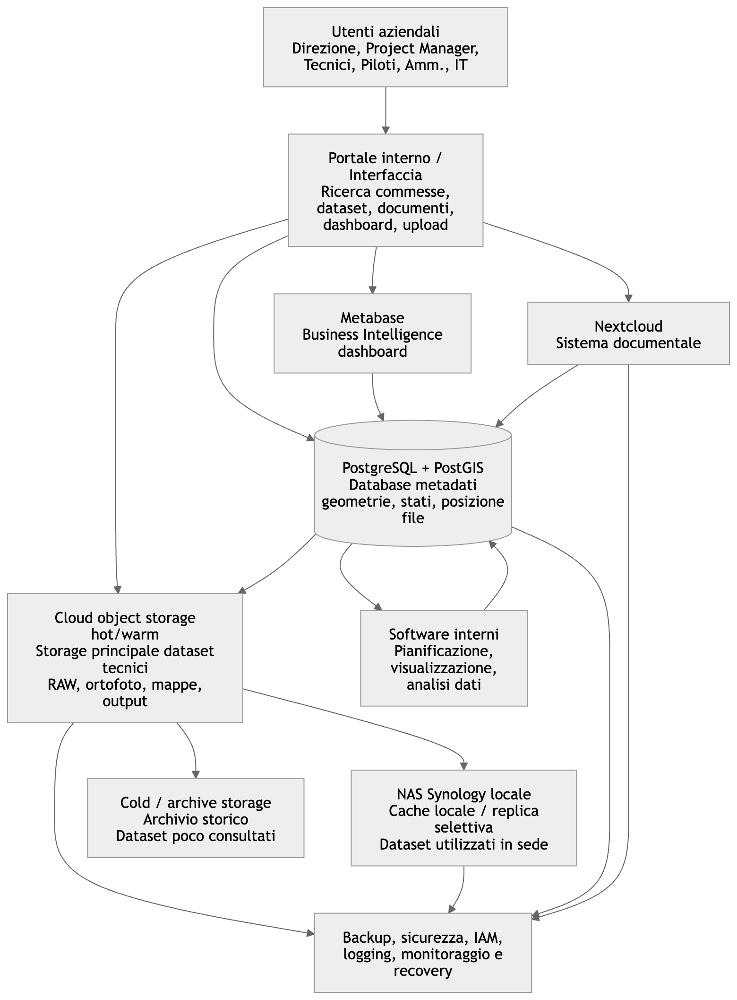
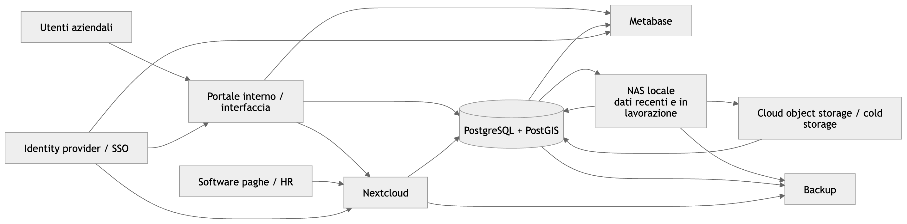

# Progetto di Sistemi Informativi – Digisky

## 1. Introduzione all'azienda

### 1.1 Descrizione generale di Digisky

**DigiSky S.r.l.** è una società torinese attiva nel settore aerospaziale, con particolare specializzazione nell'Earth
Observation, nel monitoraggio aereo del territorio, nei sistemi avionici e nelle missioni di rilievo digitale. L'azienda
dichiara oltre 20 anni di esperienza nel settore aerospace e opera tramite soluzioni proprietarie rivolte a settori come
agricoltura di precisione, infrastrutture, utilities, gestione del rischio ambientale e sorveglianza.

La società è inoltre indicata come azienda certificata EASA e fornisce servizi di progettazione avionica e test in volo
di sistemi, tecnologie e sensori. Un elemento distintivo è la presenza operativa presso il Torino Aeritalia Airport,
dove DigiSky dispone di laboratori, infrastrutture e una propria flotta per attività sperimentali e operative.

### 1.2 Dimensione aziendale e bilancio annuale

DigiSky di fatto è una PMI innovativa e specializzata, con una struttura aziendale contenuta, sull'ordine dei 10
dipendenti, ma ad alta competenza tecnica. Tale competenza si dimostra anche nei fatturati: DigiSky S.r.l. ha registrato
nel 2024 un fatturato di circa 1,74 milioni di euro e un utile netto di circa 187 mila euro.

### 1.3 Servizi offerti

DigiSky offre servizi e soluzioni legati a monitoraggio aereo, Earth Observation, progettazione avionica e sistemi per
missioni speciali. Le principali aree di attività includono:

- **Earth Observation e monitoraggio territoriale**: L'azienda sviluppa tecnologie per l'osservazione e il monitoraggio
  di territorio, infrastrutture, foreste, emergenze ambientali e aziende con asset distribuiti sul territorio. Tra i
  diversi servizi in tale ambito figurano anche osservazioni per l'agricoltura di precisione, linee elettriche,
  ferrovie, pipeline, bacini idroelettrici e dighe;
- **Progettazione e test avionici**: l'azienda supporta OEM aerospaziali e clienti industriali nelle fasi di
  progettazione, sviluppo, produzione e qualificazione in volo di sistemi avionici.
- **SmartBay e integrazione sensori**: DigiSky ha sviluppato e brevettato SmartBay, un sistema per l'imbarco di sensori
  su velivoli di aviazione generale, installabile su piattaforme ad ala fissa o rotante, vantando inoltre configurazioni
  SmartBay certificate su velivoli Tecnam P92 JS e P2006;
- **Skymetry e SkyGate**: Nel 2026 DigiSky infine ha presentato le business unit Skymetry® e SkyGate®: la prima dedicata
  ai servizi di Earth Observation ad altissima risoluzione, la seconda alla calibrazione e validazione di sistemi per
  applicazioni aeronautiche e spaziali

### 1.4 Obiettivi aziendali e strategia (DA RIVEDERE)

L'azienda si pone come obiettivo principale quello di democratizzare le attività di monitoraggio aereo, offrendo
soluzioni accessibili, versatili e ad alto contenuto tecnologico. La strategia aziendale si basa su quattro pilastri:

- Integrazione verticale della catena del valore, dalla progettazione avionica alla raccolta dati, pianificazione delle
  missioni, operazioni di volo, validazione dei dati e produzione di mappe digitali tematiche.
- **Uso di tecnologie proprietarie** (e.g. SmartBay e Skymetry) per differenziarsi nel mercato del telerilevamento e
  della mappatura aerea.
- Sfruttamento della posizione geografica nel settore aerospace, grazie alla sede operativa presso l'aeroporto Torino
  Aeritalia e alla presenza nei network aerospaziali regionali e dell'ESA Business Network.
- Supporto a innovazione, R&D e test in volo, anche tramite una propria flotta di aeromobili equipaggiati con sistemi
  avionici, pensata per validare tecnologie e dispositivi in condizioni operative reali.

---

# Mancano info

## 2. Analisi organizzativa

### 2.1 Modello organizzativo

### 2.2 Organigramma

### 2.3 Unità organizzative principali

### 2.4 Attori coinvolti nel progetto

---

## 3. Sistema Informativo AS IS

### 3.1 Descrizione dell’area IT e del sistema informativo

#### 3.1.1 Situazione attuale

Il sistema informativo AS IS si presenta come una struttura a silos privo di un unico e centralizzato database. Non è
presente nemmeno un software gestionale integrato come _ERP_ o _PLM_ che permette di facilitare le operazioni aziendali
quotidiane e lo sviluppo di nuovi prodotti. Questo sistema comporta numerosi problemi, tra cui:

- difficoltà a consegnare documenti tra reparti. Questo succede perchè non esiste nessun workflow informatico che
  notifica all'utente la disponibilità dei dati. Tutto avviene tramite comunicazioni informali come email, messaggi o a
  voce.
- difficoltà a trovare i dati all'interno delle cartelle. Poichè non c'è un database, i metadati dei documenti non sono
  salvati in campi strutturati e interrogabili, costringendo gli operatori a ricerche manuali e dispendiose.
- difficoltà ad avere dati consistenti. Siccome ogni unità organizzativa pubblica i propri documenti sul proprio
  storage, è molto facile avere gli stessi dati presenti in documenti di differenti unità. Può quindi succedere che ci
  sia inconsistenza tra i documenti se un reparto modifica il proprio, creando una situazione in cui è difficile capire
  quale siano i dati più aggiornati.

L'infrastruttura tecnologica e di archiviazione attuale di _DigiSky_ si basa su un modello ibrido non ottimizzato, che
tenta di far convivere soluzioni locali e cloud. Le piattaforme di archiviazione e i dispositivi su cui si poggia
attualmente l'azienda sono i seguenti:

- **Google Drive**: è la piattaforma cloud principale utilizzata per l'archiviazione di quasi tutta la documentazione
  aziendale. Attualmente contiene promiscuamente documenti amministrativi (fatture, contratti), file di gestione delle
  commesse (fogli Excel) e anche output pesanti delle elaborazioni geomatiche (come mappe, report finali ed ortofoto).
- **NAS** (network attached storage): contiene i dataset grezzi e in fase di elaborazione che sono utilizzati dal team
  di geomatica, che necessita di accedere rapidamente a moli enormi di foto (RAW) tramite la rete LAN aziendale ad alta
  velocità. E' presente presso la sede operativa all'Aeroporto Torino Aeritalia.
- **Supporti di memoria fisici e mobili**: a causa dell'impossibilità di caricare i file pesanti da remoto via rete, i
  tecnici della linea volo sono spesso costretti a utilizzare supporti fisici (SD Card ad alta capacità degli
  aerei/droni, SSD esterni portatili) come mezzo di archiviazione temporaneo. I dati vengono trasportati fisicamente in
  sede per essere poi trasferiti manualmente sul NAS o Google Drive.
- **Workstation locali**: macchine ad altissime prestazioni (dotate di potenti CPU e GPU per il rendering spaziale)
  utilizzate dal team di geomatica. Dispongono di storage locale ad altissima velocità (dischi NVMe) utilizzato
  esclusivamente come memoria di transito temporanea per far girare i software di fotogrammetria, prima di salvare
  l'output nuovamente sul NAS o su Drive.

#### 3.1.2 Application portfolio attuale

L'insieme dei software utilizzati da DigiSky si possono dividere in:

- **software tecnici e geomatici**. Il team di geomatica utilizza potenti software di elaborazione fotogrammetrica e
  suite GIS per trasformare i dati grezzi in ortofoto, modelli 3D e mappe tematiche. Parallelamente, per la
  progettazione avionica vengono impiegati software CAD 3D.
- **software proprietari**. Vegono utilizzati per il supporto ai propri brevetti e servizi. Gli strumenti principali
  offerti sono per la pianificazione della missione di volo dei droni, per la calibrazione dei sensori e per la gestione
  delle operazioni aeree.
- **software di produttività individuale**. Questa categoria comprende gli applicativi della suite Google Workspace
  (principalmente Google Docs, Google Sheets e Google Slides) utilizzati quotidianamente dal personale per la redazione
  di testi, report, fogli di calcolo e presentazioni.

In particolare: | Applicazione | Venditore | Funzionalità principali | | :--- | :--- | :--- | | Agisoft Metashape |
Agisoft LLC | Elaborazione fotogrammetrica per trasformare i dati grezzi in ortofoto, modelli 3D e nuvole di punti. | |
QGIS | OSGeo (Progetto Open Source) | Analisi spaziale avanzata, integrazione cartografica e disegno di mappe tematiche.
| | Pix4Dmapper | Pix4D SA | Procedure di modellazione spaziale e fotogrammetrica per i rilievi aerei. | | Software CAD
3D | Autodesk | Progettazione avionica e realizzazione di componenti su misura (es. supporti per sensori SmartBay). | |
SkyGate | Interno (DigiSky S.r.l.) | Calibrazione e validazione di sistemi e sensori per applicazioni aeronautiche e
spaziali. | | SmartBay | Interno (DigiSky S.r.l.) | Gestione software e supporto all'hardware brevettato per l'imbarco
rapido dei sensori sui velivoli. | | Microsoft Excel | Microsoft Corporation | Tracciamento dello stato delle commesse e
gestione operativa. | | Google Workspace | Google LLC | Redazione di testi, report, presentazioni, fogli di calcolo;
archiviazione e collaborazione in cloud. | | DiskStation Manager (DSM) | Synology Inc. | Sistema operativo per la
gestione del NAS locale. |

#### 3.1.3 Architettura hardware-software attuale



#### 3.1.4 Settore IT

L'attuale settore IT di _DigiSky_ è fortemente condizionato dalle dimensioni contenute dell'azienda. Contando su un
organico di una decina di persone, non esiste una divisione IT strutturata o dedicata. La gestione dell'infrastruttura
ricade quindi in modo trasversale sulle figure tecniche già operative su altri fronti lavorativi. Questo porta
inevitabilmente a una strategia che può essere definita come fortemente reattiva ed informale. Il sistema informativo
viene quindi visto come un semplice magazzino digitale piuttosto che come uno strumento che può portare
all'ottimizzazione e valorizzazione dei processi.

#### 3.1.5 Elenco dei processi chiave aziendali

I principali processi aziendali di Digisky possono essere suddivisi in processi operativi, amministrativi e di supporto
tecnologico.

**Processi operativi principali:**

- Pianificazione delle missioni con droni
- Acquisizione dati tramite rilievi aerei
- Elaborazione dati geomatici
- Analisi e interpretazione dei dati raccolti
- Produzione di report tecnici e mappe
- Gestione clienti e commesse

**Processi amministrativi:**

- Gestione documentazione interna
- Gestione HR e dipendenti
- Contabilità e fatturazione
- Gestione contratti e fornitori

**Processi IT e supporto:**

- Gestione infrastruttura IT
- Archiviazione e gestione dati
- Backup e sicurezza informatica
- Supporto tecnico interno

### 3.2 Processo chiave: acquisizione dati

#### 3.2.1 Introduzione

Tra i processi individuati, il progetto si concentra sul **processo di acquisizione dati tramite rilievi aerei**. Questo
processo è stato selezionato poiché risulta essere il più critico per il core business dell'organizzazione e rappresenta
l'attività maggiormente influenzata dalle limitazioni dell’attuale sistema informativo.

Di seguito vengono descritte le fasi chiave, gli input, gli output e le unità organizzative coinvolte:

| Fase                                           | Descrizione                                                                                                                                                  | Input                                              | Output                                       | Unità coinvolte |
| :--------------------------------------------- | :----------------------------------------------------------------------------------------------------------------------------------------------------------- | :------------------------------------------------- | :------------------------------------------- | :-------------- |
| **Definizione dei requisiti e della commessa** | Ricezione della richiesta dal cliente, definizione delle specifiche del progetto e invio della proposta per l'accettazione.                                  | Definizione dei requisiti e della commessa         | Proposta di commessa (in attesa di conferma) | Amministrazione |
| **Preparazione missione**                      | Organizzazione logistica e tecnica delle attività di volo..                                                                                                  | Commessa accettata                                 | Piano di missione                            | Linea volo      |
| **Acquisizione dati**                          | Esecuzione fisica del volo e raccolta delle informazioni sul campo.                                                                                          | Piano di missione                                  | Dati grezzi                                  | Linea volo      |
| **Controllo qualità dei dati**                 | Verifica dell'integrità, della precisione e della correttezza dei dati grezzi appena raccolti.                                                               | Dati grezzi                                        | Dati controllati e validati                  | Geomatica       |
| **Creazione dei reports**                      | Elaborazione tecnica dei dati validati, generazione del report finale e invio al cliente per l'approvazione (fase soggetta a iterazione in caso di rifiuto). | Dati controllati (e/o feedback di rifiuto cliente) | Report generato (in attesa di approvazione)  | Geomatica       |
| **Archiviazione dei reports**                  | Salvataggio definitivo e archiviazione dei report a seguito dell'approvazione esplicita del cliente, portando a compimento la richiesta.                     | Report approvati                                   | Report archiviati                            | Geomatica       |

#### 3.2.2 Diagramma UML



#### 3.2.3 Diagramma BPMN



### 3.3 Analisi delle problematiche

Nella situazione attuale, l'**archiviazione dei dati** rappresenta un problema per l'intero processo perché utilizza un
modello di archiviazione non strutturato basato interamente su Google Drive. Questo comporta numerose criticità sia per
il processo preso in analisi ma anche per altri che necessitano di andare ad analizzare vecchi reports o dati spaziali
perché diventa difficile trovarli. Gli effetti negativi dovuti a questo tipo di archiviazione possono essere così
riassunti:

| Criticità                             | Operazione influenzata     | Impatto                                                                            |
| :------------------------------------ | :------------------------- | :--------------------------------------------------------------------------------- |
| **Upload manuale dei file**           | Archiviazione dati         | Aumento dei tempi operativi e alto rischio di errore umano.                        |
| **Storage non strutturato**           | Gestione dati              | Difficoltà nella ricerca, classificazione e organizzazione dei documenti.          |
| **Duplicazione documenti**            | Condivisione tra reparti   | Presenza di versioni multiple e incoerenti dei file (problemi di versionamento).   |
| **Assenza di database centralizzato** | Gestione dati              | Limitata capacità di analisi, query avanzate e integrazione delle informazioni.    |
| **Workflow non automatizzati**        | Gestione operativa         | Elevato numero di attività manuali, ripetitive e dipendenti dai singoli operatori. |
| **Ricerca lenta delle info**          | Accesso ai documenti       | Ritardi significativi nelle attività operative e nel decision-making.              |
| **Scarsa integrazione software**      | Intero sistema informativo | Minore efficienza globale e isolamento dei dati (silos informativi).               |

#### 3.3.1 Difficoltà nell'analisi efficace dei dati

Digisky gestisce una grande quantità di dati provenienti da rilievi aerei, elaborazioni geomatiche e attività operative
interne. Attualmente, l'assenza di strumenti centralizzati di Business Intelligence e di analisi avanzata rende
complessa l'elaborazione efficace delle informazioni. Le attività di analisi richiedono spesso operazioni manuali e
tempi elevati, riducendo la rapidità decisionale. La mancanza di dashboard integrate limita inoltre la possibilità di
ottenere informazioni aggiornate in tempo reale.

#### 3.3.2 Memorizzazione dati non strutturata su Google Drive

Gran parte dei documenti aziendali e dei file operativi (inclusi i file di output dei rilevi) viene archiviata tramite
Google Drive utilizzando cartelle condivise. Con la crescita del volume dei dati, questo sistema risulta sempre meno
efficiente, generando difficoltà nella classificazione, problemi di versionamento e un'organizzazione non standardizzata
tra i reparti.

#### 3.3.3 Costi elevati di archiviazione e gestione

L'utilizzo di sistemi non strutturati genera costi indiretti legati principalmente al tempo impiegato dal personale per
la gestione manuale. Le inefficienze riguardano la ricerca dei documenti, la manutenzione delle cartelle e l'invio
manuale degli aggiornamenti, aumentando il carico operativo sia per il personale amministrativo sia per i reparti
tecnici (come geomatica e linea volo).

#### 3.3.4 Assenza di database strutturati

Attualmente i dati aziendali risultano distribuiti tra file Excel, documenti condivisi e archivi cloud senza una
struttura relazionale. Questa situazione comporta l'impossibilità di effettuare query avanzate, problemi di consistenza
(dati duplicati o non aggiornati) e difficoltà di integrazione con nuovi software aziendali.

#### 3.3.5 Processi interni manuali e ripetitivi

Molte attività vengono svolte manualmente, soprattutto nei passaggi di stato del processo (es. passaggio di consegne tra
linea volo e geomatica). Tra le attività ripetitive figurano l'inserimento manuale dei dati, l'invio manuale dei file
tra reparti e il controllo umano delle versioni. L'automazione di questi workflow rappresenta un elemento fondamentale
per ridurre il rischio di errore umano e migliorare l'efficienza organizzativa.

---

## 4. Situazione TO BE

La soluzione proposta prevede l'introduzione di un'architettura informativa ibrida, pensata per gestire in modo più
efficiente grandi volumi di dati, ridurre la dipendenza da Google Drive e migliorare l'organizzazione complessiva delle
informazioni aziendali. DigiSky produce infatti grandi quantità di dati derivanti da attività di rilievo tramite droni e
aeromobili, come fotografie RAW, ortofoto, mappe e altri file tecnici di grandi dimensioni. Considerando che il volume
complessivo dei dati può raggiungere e superare i 100 TB, una gestione basata principalmente su Google Drive risulta
poco adatta, sia per motivi economici sia per ragioni organizzative, operative e di integrazione con gli strumenti
aziendali.

Dal confronto con l'azienda è emerso che si dispone già di un NAS locale Synology, utilizzato per memorizzare i dataset
in lavorazione e sincronizzato bilateralmente con Google Drive. Tuttavia, tale soluzione presenta alcune criticità. Il
NAS dipende dalla sede fisica dell'azienda, dalla stabilità della rete elettrica e dalla capacità della connessione WAN
disponibile. In particolare, i caricamenti da parte dei piloti e degli operatori fuori sede possono risultare lenti,
poiché il trasferimento dei dati verso il NAS deve passare dalla connessione esterna della sede, limitata a circa 100
Mbit/s. Inoltre, la rete elettrica a cui il NAS è collegato, pur essendo protetta da UPS, non garantisce piena business
continuity.

Per questi motivi, nella situazione TO BE il NAS non viene considerato come storage principale di produzione, ma viene
riposizionato come componente di supporto: cache locale, replica operativa o copia di sicurezza dei dataset più
utilizzati in sede. Lo storage principale dei dataset tecnici viene invece spostato verso un cloud object storage, ad
esempio una soluzione compatibile con S3 in classe hot/warm, più adatta a garantire accessibilità da remoto,
scalabilità, integrazione con i software interni e continuità operativa.

La soluzione TO BE non consiste quindi nella semplice sostituzione di Google Drive con un altro archivio, ma nella
costruzione di un sistema strutturato, composto da più elementi specializzati:

- Dataset tecnici di produzione → cloud object storage;
- Dataset in lavorazione presso la sede → NAS Synology come cache locale o replica selettiva;
- Dataset storici o poco consultati → cold storage / archive storage;
- Metadati tecnici, gestionali e geografici → PostgreSQL + PostGIS;
- Documenti aziendali e di progetto → sistema documentale dedicato;
- Analisi e controllo dei dati → strumenti di Business Intelligence;
- Software interni di pianificazione e visualizzazione → integrazione tramite database centrale e API.

L'idea alla base della soluzione è separare i file tecnici pesanti dai metadati che li descrivono. Le immagini RAW, le
ortofoto, le mappe e gli altri file tecnici non vengono salvati direttamente nel database, perché avrebbero dimensioni
troppo elevate e renderebbero il sistema inefficiente. Tali file vengono invece conservati nello storage cloud, mentre
il database mantiene le informazioni necessarie per identificarli, ricercarli e collegarli alle commesse aziendali.

Il database PostgreSQL/PostGIS assume quindi il ruolo di fonte unica dei metadati. Esso permette di sapere a quale
cliente e commessa appartiene un dataset, quale missione lo ha generato, quale area geografica copre, quale sensore è
stato utilizzato, in quale stato di elaborazione si trova e dove è fisicamente conservato il file. La posizione del
dataset può essere riferita allo storage cloud principale, al NAS locale nel caso esista una copia in cache, oppure al
cold storage nel caso di dati storici.

In questo modo gli utenti e i software interni non devono più cercare manualmente tra cartelle diverse o sistemi
separati. Possono invece interrogare il database per recuperare le informazioni aggiornate sul dataset e accedere alla
posizione corretta del file. Questo approccio consente di costruire un sistema informativo condiviso tra i diversi
servizi aziendali, integrando anche gli strumenti sviluppati internamente per la pianificazione, la visualizzazione e
l'analisi del dato.

Il NAS locale mantiene comunque un ruolo importante. Esso può conservare copie selettive dei dataset più recenti o più
utilizzati dai tecnici in sede, così da garantire rapidità di accesso durante le fasi di elaborazione, mosaicizzazione e
controllo qualità. Tuttavia, il NAS non rappresenta più un punto critico dell'architettura: se dovesse risultare
temporaneamente indisponibile, il dato principale resterebbe comunque conservato nel cloud.

I dataset storici o consultati raramente possono invece essere spostati progressivamente verso classi di storage più
economiche, come cold storage o archive storage. In questo modo l'azienda evita di mantenere tutti i dati nello spazio
più performante e costoso, applicando una logica di archiviazione basata sulla frequenza di utilizzo.

Di seguito una rappresentazione del modello proposto:

```
                    Utenti aziendali
                           |
                           v
                  Portale interno / interfaccia
                           |
        +------------------+------------------+
        |                  |                  |
        v                  v                  v
PostgreSQL + PostGIS   Sistema            Business
metadati e geometrie   documentale        Intelligence
        |
        v
Cloud object storage
storage primario dei dataset tecnici
        |
        +-----------------------------+
        |                             |
        v                             v
NAS Synology locale              Cold / archive storage
cache locale / replica           archivio storico e
dei dati in lavorazione          dataset poco consultati
```

In sintesi, la nuova architettura segue una logica cloud-first per i file tecnici, database-first per i metadati e NAS
come supporto locale. Questo consente di ridurre la dipendenza da Google Drive, migliorare l'accessibilità dei dataset
da postazioni esterne, aumentare la business continuity e rendere i dati più facilmente integrabili con i software
interni dell'azienda.

#### 4.1.2 Introduzione di un database centralizzato

L'idea di introdurre un database centralizzato ha l'obiettivo di organizzare in modo strutturato le informazioni
relative a clienti, commesse, missioni di volo, dataset, elaborazioni e output finali. Il database centralizzato non ha
lo scopo di sostituire lo storage dei file pesanti. Le immagini RAW, le ortofoto e le mappe di grandi dimensioni
verranno conservate in sistemi di archiviazione dedicati. Nella soluzione TO BE, lo storage principale dei dataset
tecnici sarà rappresentato dal cloud object storage, mentre il NAS locale Synology verrà utilizzato come cache locale o
replica operativa dei dataset più utilizzati in sede. Il database avrà invece il compito di memorizzare i metadati, cioè
le informazioni descrittive, gestionali e tecniche associate a quei file. In questo modo, il file fisico resta nello
storage più adatto alla sua dimensione e frequenza di utilizzo, mentre il database conserva tutte le informazioni
necessarie per identificarlo, ricercarlo e collegarlo ai processi aziendali.

Nella pratica, il database centralizzato svolge il ruolo di indice intelligente dei dati aziendali. Esso permette di
sapere non solo dove si trova un file, ma anche a quale attività è collegato, chi lo ha prodotto, in quale stato si
trova e quale valore ha all'interno della commessa. Per esempio, un dataset fotografico prodotto durante una missione di
volo potrà essere descritto nel database attraverso informazioni come:

```
codice commessa: id
cliente: str
data della missione: date
area geografica rilevata: str
mezzo utilizzato: str
sensore utilizzato: str
numero di immagini acquisite: int
dimensione complessiva del dataset: int
storage principale: enum[CLOUD_OBJECT_STORAGE, COLD_STORAGE]
copia locale NAS: bool
posizione file cloud: uri
posizione copia NAS: path
stato di elaborazione: enum[DONE, PROCESSING, FAILED]
data di consegna: date
responsabile tecnico: str
```

Con una semplice query, in aggiunta, partendo da una commessa sarà possibile visualizzare:

```
cliente: str
missioni di volo effettuate: int
dataset acquisiti: int
elaborazioni eseguite: int
output generati: int
documenti collegati: array
stato di avanzamento: enum[DONE, PROCESSING, FAILED]
spazio occupato: int
posizione attuale dei file: uri/path
classe di storage: enum[HOT_WARM, COLD_ARCHIVE]
copia locale NAS: bool
```

Per la sua realizzazione, si propone l'utilizzo di PostgreSQL con estensione PostGIS. In particolare, è un database
relazionale open source adatto alla gestione di dati strutturati, mentre l'estensione PostGIS permette di aggiungere al
database funzionalità geografiche e spaziali. Questo aspetto è particolarmente importante per un'azienda che lavora con
rilievi aerei, mappe e dati territoriali, consentendo ricerche più avanzate rispetto a un normale database gestionale.

La struttura logica del database può essere organizzata intorno ad alcune entità principali, che rappresentano gli
oggetti informativi più importanti dei vari processi.

| Entità               | Descrizione                                                                                                                    |
| -------------------- | ------------------------------------------------------------------------------------------------------------------------------ |
| **Cliente**          | Contiene l'anagrafica dei clienti, i referenti e le informazioni commerciali principali.                                       |
| **Commessa**         | Rappresenta un progetto o incarico affidato all'azienda. È collegata a un cliente e contiene stato, scadenze e responsabilità. |
| **Area di rilievo**  | Descrive l'area geografica interessata dalla commessa, includendo coordinate, poligoni o superfici rilevate.                   |
| **Missione di volo** | Rappresenta l'attività operativa di acquisizione dati tramite drone o aeromobile.                                              |
| **Aeromobile/Drone** | Contiene le informazioni sui mezzi utilizzati nelle missioni.                                                                  |
| **Sensore**          | Descrive fotocamere, camere multispettrali, LiDAR o altri dispositivi di acquisizione.                                         |
| **Dataset**          | Rappresenta l'insieme dei file prodotti da una missione, come immagini RAW o dati acquisiti.                                   |
| **Elaborazione**     | Descrive i processi di mosaicizzazione, ortorettifica, analisi o post-processing.                                              |
| **Output**           | Contiene le informazioni sugli elaborati finali, come ortofoto, mappe, report o file consegnabili.                             |
| **Documento**        | Rappresenta il collegamento ai documenti gestiti nel sistema documentale.                                                      |
| **Utente**           | Contiene le informazioni sugli utenti autorizzati e sui rispettivi ruoli.                                                      |

#### 4.1.3 Introduzione di strumenti di Business Intelligence

L'introduzione di strumenti di Business Intelligence ha l'obiettivo di trasformare i dati raccolti dal sistema
informativo in informazioni utili per il controllo e il miglioramento dei processi aziendali.

Poiché l'azienda gestisce grandi quantità di dati diventa importante poter monitorare in modo chiaro l'utilizzo dello
storage, lo stato delle commesse, i tempi di lavorazione e i costi associati ai dataset prodotti. Gli strumenti di BI
permettono quindi di leggere i dati presenti nel database centralizzato e trasformarli in dashboard, indicatori e report
consultabili dalla direzione, dai project manager e dai responsabili tecnici.

Tradotto nel modello che proponiamo, questo si collega principalmente al database PostgreSQL/PostGIS, dal quale recupera
informazioni relative a clienti, commesse, missioni di volo, dataset, dimensioni dei file, stato delle elaborazioni,
output prodotti e posizione dei dati nello storage. In questo modo, i dati tecnici e gestionali raccolti durante il
ciclo di vita della commessa possono essere utilizzati per ottenere una visione complessiva dell'attività aziendale.

Ad esempio, attraverso una dashboard dedicata allo storage, sarà possibile visualizzare informazioni come:

```
spazio totale utilizzato: int
spazio occupato nello storage cloud operativo: int
spazio occupato nel cold/archive storage: int
spazio occupato nella cache NAS locale: int
dataset replicati sul NAS: array
crescita mensile dello storage: float
spazio occupato per cliente: array
spazio occupato per commessa: array
costo stimato per TB: float
dataset non consultati da oltre 12 mesi: array
dataset candidati allo spostamento in cold storage: array
```

Queste informazioni permettono, secondo noi, di passare da una gestione basata su controlli manuali e verifiche puntuali
a una gestione più proattiva, fondata su dati aggiornati e facilmente consultabili. Ad esempio, la direzione potrà
individuare quali clienti generano più dati, quali commesse hanno un costo di archiviazione più elevato o quali dataset
possono essere spostati dallo storage cloud operativo verso classi di storage più economiche, come cold storage o
archive storage.

Collegando i dati tecnici presenti nel database con informazioni economiche, come valore della commessa, costi di
archiviazione e tempi di lavorazione, sarà inoltre possibile stimare meglio la redditività dei progetti grazie a
strumenti del genere. Di seguito proponiamo una possibile organizzazione delle dashboard:

| Dashboard                         | Descrizione                                                  | Indicatori principali                                                                                                                                                                                                                        |
| --------------------------------- | ------------------------------------------------------------ | -------------------------------------------------------------------------------------------------------------------------------------------------------------------------------------------------------------------------------------------- |
| **Storage e costi**               | Monitora l'utilizzo dello spazio e i costi di archiviazione. | TB totali, spazio occupato nello storage cloud operativo, spazio occupato nel cold/archive storage, spazio occupato nella cache NAS locale, dataset replicati sul NAS, dataset candidati allo spostamento in cold storage, dati per cliente. |
| **Commesse**                      | Monitora lo stato di avanzamento dei progetti.               | Commesse attive, commesse concluse, commesse in ritardo, output da validare, tempi di consegna.                                                                                                                                              |
| **Produzione tecnica**            | Analizza le attività operative e i dati prodotti.            | Missioni svolte, GB prodotti per missione, sensori utilizzati, elaborazioni completate, rilavorazioni.                                                                                                                                       |
| **Economico-gestionale**          | Collega i dati tecnici ai dati economici.                    | Ricavo per commessa, costo storage per commessa, redditività cliente, clienti ad alto consumo di storage.                                                                                                                                    |
| **Monitoraggio infrastrutturale** | Controlla lo stato tecnico dei sistemi.                      | Spazio residuo NAS, stato backup, errori di sincronizzazione, saturazione storage, alert tecnici.                                                                                                                                            |

La nostra proposta ricade sull'adozione di **Metabase** come strumento principale di Business Intelligence: esso
consente di creare dashboard e report collegandosi direttamente al database senza introdurre un'infrastruttura
eccessivamente complessa. Attraverso Metabase sarà possibile monitorare indicatori relativi allo spazio occupato, alla
crescita dello storage, allo stato delle commesse, ai dataset archiviati, ai tempi di elaborazione e ai costi associati
ai dati prodotti. La scelta di Metabase permette inoltre di contenere i costi iniziali, mantenendo comunque la
possibilità di realizzare dashboard operative e direzionali facilmente consultabili dagli utenti autorizzati. In questo
modo DigiSky potrà passare da una gestione reattiva, basata su controlli manuali e verifiche occasionali, a una gestione
più proattiva come dicevamo prima e basata su dati aggiornati.

#### 4.1.4 Introduzione di un sistema documentale

L'introduzione di un sistema documentale ha l'obiettivo di separare la gestione dei documenti aziendali dalla gestione
dei dataset tecnici pesanti. Nel contesto analizzato, infatti, non tutti i file hanno la stessa natura: da un lato
esistono immagini RAW, ortofoto, mappe e file geospaziali di grandi dimensioni; dall'altro lato esistono documenti
amministrativi, commerciali, tecnici e HR che richiedono logiche di gestione diverse.

Il sistema documentale non ha quindi lo scopo di archiviare i 100 TB di dati aerofotogrammetrici prodotti dall'azienda.
Questi continueranno a essere gestiti tramite cloud object storage come storage principale, con eventuale replica o
cache locale sul NAS Synology per i dataset utilizzati nelle lavorazioni interne. Il documentale servirà invece per
organizzare e controllare documenti come contratti, offerte, report tecnici, certificazioni, manuali, documenti
amministrativi, documenti di commessa e documentazione del personale.

Attualmente, l'utilizzo di Google Drive come contenitore unico rischia di creare confusione tra dati molto diversi tra
loro. Nello stesso ambiente possono trovarsi cartelle con foto RAW, mappe elaborate, report finali, preventivi,
contratti, fatture e documenti interni. Questa situazione rende più difficile individuare la versione corretta di un
documento, controllare gli accessi, ricostruire lo storico delle modifiche e distinguere i documenti ufficiali dai file
di lavoro.

Nel modello TO BE, il sistema documentale viene introdotto per gestire in modo ordinato i documenti aziendali, lasciando
allo storage tecnico il compito di conservare i file pesanti. In questo modo ogni categoria di informazione viene
trattata con lo strumento più adatto.

Una possibile classificazione dei documenti gestiti è la seguente:

| Categoria               | Documenti gestiti                                                        | Utenti principali                        |
| ----------------------- | ------------------------------------------------------------------------ | ---------------------------------------- |
| **Commerciale**         | offerte, preventivi, contratti, documenti cliente                        | direzione, commerciale, amministrazione  |
| **Tecnica**             | report tecnici, manuali, documenti di commessa, certificazioni operative | tecnici, project manager, direzione      |
| **Amministrativa**      | fatture, ordini, documenti fornitori, comunicazioni amministrative       | amministrazione, direzione               |
| **Qualità e sicurezza** | procedure, verbali, certificazioni, documenti normativi                  | direzione, qualità, responsabili tecnici |
| **HR**                  | contratti dipendenti, attestati, comunicazioni interne                   | HR, dipendenti autorizzati               |

Un ulteriore vantaggio offerto da questo approccio è il **versioning**: con un sistema documentale, il documento
mantiene una sola identità e le modifiche vengono tracciate come versioni successive, evitando il rischio di duplicati o
versioni non controllate. In questo modo è possibile sapere quale sia la versione più aggiornata, chi l'ha modificata e
quando.

Il sistema verrebbe gestito chiaramente seguendo una struttura gerarchica e di controllo degli accessi, per evitare
modifiche da parte di persone non coinvolte in manipolazioni dati delicate. Un altro aspetto rilevante è il controllo
degli accessi. Non tutti gli utenti aziendali devono infatti poter consultare o modificare tutti i documenti. Ad
esempio, un tecnico può avere accesso ai report di commessa, ma non necessariamente ai documenti HR o ai contratti
economici. Allo stesso modo, un dipendente deve poter accedere ai propri documenti personali, ma non a quelli degli
altri dipendenti.

Il sistema documentale può inoltre supportare workflow di approvazione. Per esempio, un report tecnico prodotto al
termine di una commessa potrebbe seguire un processo strutturato prima di essere inviato al cliente:

- creazione bozza da parte del tecnico
- revisione del project manager
- eventuale correzione
- approvazione finale
- pubblicazione come documento ufficiale
- consegna al cliente

Questo permette di ridurre il rischio che vengano inviati documenti non validati o versioni non definitive.

Per quanto riguarda la scelta dello strumento, nel progetto si può valutare l'utilizzo di soluzioni come SharePoint,
Nextcloud o Alfresco. Tuttavia, considerando l'esigenza di separare i documenti dai dataset tecnici e di mantenere una
soluzione flessibile e controllabile, la nostra scelta è ricaduta su Nextcloud.

Nextcloud permette di gestire documenti in un ambiente centralizzato, con funzionalità di condivisione, permessi,
versionamento e accesso controllato. Può essere installato su infrastruttura propria o su server dedicato, integrandosi
con la logica generale della soluzione TO BE, che prevede cloud object storage come storage principale dei dataset
tecnici, NAS locale come cache o replica operativa, PostgreSQL/PostGIS per i metadati e strumenti di BI per il
monitoraggio.

#### 4.1.7 Unità organizzative coinvolte nel TO BE

L'introduzione della nuova architettura informativa TO BE non riguarda esclusivamente l'area tecnica o informatica, ma
coinvolge diverse unità organizzative aziendali. La soluzione proposta, infatti, modifica il modo in cui i dati vengono
prodotti, archiviati, ricercati, elaborati e utilizzati per prendere decisioni.

Le unità organizzative coinvolte possono essere individuate principalmente nelle seguenti aree:

| Unità organizzativa                       | Ruolo nel sistema TO BE                                                                                                                                                       |
| ----------------------------------------- | ----------------------------------------------------------------------------------------------------------------------------------------------------------------------------- |
| **Direzione**                             | Definisce le priorità strategiche, monitora costi, redditività delle commesse e andamento generale tramite dashboard di Business Intelligence.                                |
| **Project Management**                    | Coordina le commesse, controlla lo stato di avanzamento, verifica le consegne e utilizza il database per monitorare missioni, dataset, output e documenti collegati.          |
| **Area tecnica / operatori di volo**      | Produce i dati tramite droni e aeromobili, registra le missioni di volo, carica i dataset sul cloud object storage e aggiorna/verifica le informazioni operative nel sistema. |
| **Area elaborazione dati**                | Gestisce le fasi di post-processing, mosaicizzazione, ortorettifica, controllo qualità e produzione degli output finali.                                                      |
| **Amministrazione**                       | Gestisce documenti amministrativi, contratti, fatture, ordini e può consultare informazioni economiche collegate alle commesse.                                               |
| **Commerciale**                           | Accede a documenti cliente, offerte, preventivi e informazioni sulle commesse utili per la gestione del rapporto commerciale.                                                 |
| **IT / responsabile sistemi informativi** | Gestisce l'infrastruttura tecnica, il NAS, il database, il sistema documentale, i backup, gli accessi e l'integrazione tra i vari componenti.                                 |
| **Qualità e sicurezza**                   | Gestisce procedure, certificazioni, documenti normativi e controlla che i flussi documentali seguano regole definite.                                                         |
| **HR**                                    | Utilizza il sistema documentale per la gestione dei documenti relativi al personale, con accessi riservati e controllati.                                                     |

Nel nuovo modello, ogni area mantiene le proprie responsabilità, ma lavora su un sistema informativo più ordinato e
integrato. Questo permette di ridurre la dispersione delle informazioni, limitare la duplicazione dei file e rendere più
chiaro chi deve produrre, validare, consultare o archiviare un determinato dato.

Un aspetto importante è la definizione dei ruoli e dei permessi. Non tutti gli utenti devono avere accesso agli stessi
contenuti: ad esempio, un tecnico potrà accedere ai dataset di una missione e ai report tecnici, ma non necessariamente
ai documenti HR o ai contratti economici. Allo stesso modo, la direzione potrà visualizzare dashboard aggregate
sull'andamento delle commesse e sui costi dello storage, senza dover accedere manualmente alle cartelle operative.

Il modello TO BE introduce quindi una maggiore responsabilizzazione degli utenti, perché ogni unità organizzativa opera
su dati più tracciabili, aggiornati e collegati ai processi aziendali.

#### 4.1.8 Modello tecnologico TO BE

Il modello tecnologico TO BE si basa su un'architettura composta da più livelli, ognuno dei quali ha una funzione
specifica. L'obiettivo non è concentrare tutte le informazioni in un unico strumento, come accade oggi con Google Drive,
ma distribuire i dati su componenti specializzati e tra loro collegati.

La logica generale del modello è la seguente:

- i file tecnici pesanti vengono conservati principalmente su cloud object storage;
- il NAS locale viene utilizzato come cache o replica selettiva dei dataset in lavorazione presso la sede;
- i dataset storici o poco consultati vengono spostati verso cold/archive storage;
- i metadati vengono registrati nel database centralizzato PostgreSQL/PostGIS;
- i documenti aziendali vengono gestiti in un sistema documentale dedicato;
- i dati gestionali e tecnici vengono analizzati tramite strumenti di Business Intelligence;
- i software interni di pianificazione e visualizzazione possono integrarsi con il database centrale;
- gli utenti accedono alle informazioni attraverso interfacce controllate.

| Livello                                  | Componente                                         | Funzione                                                                                                                           |
| ---------------------------------------- | -------------------------------------------------- | ---------------------------------------------------------------------------------------------------------------------------------- |
| **Livello utente**                       | Portale interno / interfaccia applicativa          | Permette agli utenti di cercare commesse, dataset, documenti, output e informazioni operative.                                     |
| **Livello integrazione applicativa**     | API / connettori verso software interni            | Consente ai software sviluppati internamente di leggere e aggiornare metadati, stati e riferimenti ai dataset.                     |
| **Livello dati strutturati**             | PostgreSQL + PostGIS                               | Gestisce metadati, relazioni tra entità, informazioni geografiche, posizione dei file e stato dei processi.                        |
| **Livello storage operativo principale** | Cloud object storage hot/warm                      | Conserva i dataset tecnici di produzione, rendendoli accessibili anche da postazioni esterne e migliorando la business continuity. |
| **Livello cache locale**                 | NAS Synology locale                                | Mantiene copie selettive dei dataset più utilizzati in sede, supportando le attività di elaborazione tecnica quotidiana.           |
| **Livello storage storico**              | Cold / archive storage                             | Conserva dataset storici, poco consultati o non più in lavorazione, riducendo i costi di archiviazione.                            |
| **Livello documentale**                  | Nextcloud                                          | Gestisce documenti aziendali, versioning, permessi, condivisioni e workflow documentali.                                           |
| **Livello analitico**                    | Metabase                                           | Produce dashboard e report per monitorare storage, commesse, costi, tempi e produzione tecnica.                                    |
| **Livello sicurezza e gestione**         | Sistema di autenticazione, ruoli, backup e logging | Controlla accessi, autorizzazioni, tracciabilità, protezione dei dati e continuità operativa.                                      |

#### 4.1.9 Deployment diagram

Il deployment diagram rappresenta la distribuzione logica dei principali componenti tecnologici della soluzione TO BE e
le relazioni tra utenti, applicazioni, database e sistemi di storage.

Nel modello proposto, il componente centrale per la conservazione dei dataset tecnici non è più il NAS locale, ma il
cloud object storage hot/warm, che svolge il ruolo di storage principale dei file di produzione. Il NAS Synology già
presente in azienda viene invece utilizzato come cache locale o replica selettiva dei dataset più utilizzati in sede.

Il database PostgreSQL/PostGIS rappresenta il punto centrale per la gestione dei metadati: non contiene direttamente i
file pesanti, ma mantiene le informazioni relative a clienti, commesse, missioni, dataset, aree geografiche, stati di
lavorazione e posizione dei file nei diversi storage. Gli strumenti di Business Intelligence, i software interni e il
portale applicativo possono quindi interrogare il database per recuperare dati aggiornati e coerenti.



In questo modello, i dataset prodotti dai piloti e dagli operatori vengono caricati direttamente verso il cloud object
storage tramite il portale o strumenti di upload dedicati. Successivamente, se un dataset deve essere elaborato in sede,
può essere replicato in modo selettivo sul NAS Synology locale. In questo modo il NAS continua a garantire rapidità di
accesso ai tecnici, ma non rappresenta più il punto critico dell'architettura.

Il cold/archive storage viene utilizzato per conservare i dataset storici o raramente consultati, riducendo i costi di
archiviazione. Il database mantiene aggiornata la posizione dei file, distinguendo tra storage operativo cloud,
eventuale copia locale su NAS e archivio storico.

Metabase si collega al database PostgreSQL/PostGIS per produrre dashboard e report su costi, storage, commesse e
produzione tecnica. Nextcloud gestisce invece i documenti aziendali e di commessa, separandoli dai dataset tecnici
pesanti.

Il deployment proposto permette quindi di migliorare l'accessibilità dei dati da remoto, ridurre la dipendenza dalla
sede fisica, aumentare la continuità operativa e integrare in modo più efficace i software interni dell'azienda.

#### 4.1.10 Diagramma BPMN TO BE

DA FARE BENE

### 4.2 Dimensione tecnologica

#### 4.2.1 Nuovo application portfolio

Il nuovo application portfolio rappresenta l'insieme delle applicazioni e dei componenti tecnologici che Digisky
dovrebbe utilizzare, a nostro avviso, nella situazione TO BE.

| Applicazione / componente                 | Vendor / tecnologia                                                            | Funzione principale                                                                                        | Stato                        | Motivazione                                                                                                                    |
| ----------------------------------------- | ------------------------------------------------------------------------------ | ---------------------------------------------------------------------------------------------------------- | ---------------------------- | ------------------------------------------------------------------------------------------------------------------------------ |
| **Google Drive / Google Workspace**       | Google                                                                         | Collaborazione su documenti leggeri, email, calendari e file condivisi                                     | Esistente, da ridimensionare | Rimane utile per la produttività quotidiana, ma non deve più essere usato come archivio principale per dataset tecnici pesanti |
| **Cloud object storage hot/warm**         | AWS S3, Google Cloud Storage, Azure Blob o equivalente                         | Storage principale dei dataset tecnici di produzione: RAW, ortofoto, mappe e output                        | Nuovo                        | Garantisce accessibilità da remoto, scalabilità e maggiore business continuity rispetto al NAS locale                          |
| **NAS Synology locale**                   | Synology già presente in azienda                                               | Cache locale, replica selettiva e supporto operativo per i dataset utilizzati in sede                      | Esistente, da riposizionare  | Non viene eliminato, ma non rappresenta più lo storage principale; serve a velocizzare le lavorazioni interne                  |
| **Cold / archive storage**                | AWS S3 Glacier, Google Cloud Storage Archive, Azure Blob Archive o equivalente | Archiviazione economica di dataset storici o raramente consultati                                          | Nuovo                        | Riduce i costi di conservazione dei dati non più usati quotidianamente                                                         |
| **PostgreSQL + PostGIS**                  | Open source                                                                    | Database centralizzato per metadati tecnici, gestionali e geografici                                       | Nuovo                        | Permette di indicizzare commesse, missioni, dataset, posizioni file, aree geografiche e stati di lavorazione                   |
| **Nextcloud**                             | Open source / self-hosted o managed                                            | Sistema documentale per documenti aziendali, versioning, permessi e condivisione controllata               | Nuovo                        | Separa la gestione dei documenti aziendali dai dataset tecnici pesanti                                                         |
| **Metabase**                              | Open source / SaaS                                                             | Business Intelligence, dashboard e report automatici                                                       | Nuovo                        | Permette di monitorare storage, costi, commesse, produzione tecnica e performance operative                                    |
| **API / connettori per software interni** | Sviluppo interno o misto                                                       | Integrazione tra database centrale, storage cloud e software aziendali di pianificazione e visualizzazione | Nuovo                        | Consente ai software sviluppati internamente di accedere a metadati e posizione dei dataset                                    |
| **ETL / script di sincronizzazione**      | Sviluppo interno o tool dedicati                                               | Migrazione, sincronizzazione selettiva, aggiornamento metadati e lifecycle dei dataset                     | Nuovo                        | Automatizza il collegamento tra cloud storage, NAS, cold storage e database                                                    |
| **Sistema di backup e disaster recovery** | Soluzione cloud / provider esterno / replica dedicata                          | Backup periodici, recovery e protezione dei dati                                                           | Nuovo o da potenziare        | Garantisce continuità operativa e protezione da perdita dati                                                                   |
| **Identity & Access Management**          | Google Workspace, LDAP, SSO o sistema equivalente                              | Gestione utenti, ruoli, permessi e autenticazione                                                          | Esistente o da potenziare    | Permette accessi controllati a cloud storage, NAS, database, documentale e dashboard                                           |

Il cambiamento principale consiste nel passaggio da una logica file-based e NAS-first a una logica data-driven e
cloud-first. I file pesanti continuano a esistere, ma non sono più gestiti principalmente tramite cartelle locali o
Google Drive: vengono conservati in cloud object storage, descritti tramite metadati nel database e resi ricercabili
attraverso il portale e gli strumenti interni. Il NAS locale rimane utile come cache o replica operativa, ma non
rappresenta più il punto centrale dell'architettura.

#### 4.2.2 Funzioni software richieste

| Funzione software richiesta                 | Descrizione                                                                                                    | Criticità AS IS risolta                                                                       |
| ------------------------------------------- | -------------------------------------------------------------------------------------------------------------- | --------------------------------------------------------------------------------------------- |
| **Archiviazione cloud dei dataset tecnici** | Salvare i dataset pesanti di produzione su cloud object storage hot/warm                                       | Dipendenza da Google Drive e dal NAS locale come punto centrale                               |
| **Upload remoto dei dataset**               | Consentire a piloti e operatori fuori sede di caricare i dati direttamente sul cloud storage                   | Collo di bottiglia della WAN aziendale e difficoltà di caricamento da remoto                  |
| **Cache locale su NAS**                     | Mantenere sul NAS Synology copie selettive dei dataset più utilizzati in sede                                  | Necessità di accesso rapido ai file durante elaborazione, mosaicizzazione e controllo qualità |
| **Archiviazione dati storici**              | Spostare verso cold/archive storage i dataset poco consultati                                                  | Costi elevati dovuti al mantenimento di tutti i dati nello storage operativo                  |
| **Gestione metadati**                       | Registrare informazioni su cliente, commessa, missione, dataset, output, posizione file e stato di lavorazione | Impossibilità di interrogare i dati in modo strutturato                                       |
| **Gestione dati geografici**                | Salvare aree di rilievo, coordinate, poligoni e geometrie tramite PostGIS                                      | Difficoltà nel collegare dataset e commesse a informazioni territoriali                       |
| **Ricerca dataset**                         | Cercare dataset per cliente, commessa, data, area geografica, stato, dimensione o posizione                    | Ricerca manuale tra cartelle e sottocartelle                                                  |
| **Tracciamento posizione file**             | Mantenere aggiornata la posizione del file tra cloud operativo, NAS cache e cold storage                       | Perdita di controllo sulla localizzazione dei dataset                                         |
| **Integrazione con software interni**       | Consentire ai software aziendali di pianificazione e visualizzazione di interrogare il database centrale       | Frammentazione informativa tra strumenti diversi                                              |
| **Validazione dati e metadati**             | Controllare completezza, formato e coerenza delle informazioni inserite                                        | Errori manuali e dati incompleti                                                              |
| **Gestione documentale**                    | Gestire documenti aziendali, report, contratti, certificazioni e documenti HR                                  | Confusione tra documenti aziendali e dataset tecnici pesanti                                  |
| **Versioning documentale**                  | Conservare versioni successive dei documenti ufficiali                                                         | Duplicazione di file e incertezza sulla versione corretta                                     |
| **Workflow approvativi**                    | Gestire revisione e approvazione di report tecnici e documenti ufficiali                                       | Invio di documenti non validati o versioni non definitive                                     |
| **Dashboard BI**                            | Visualizzare indicatori su storage, costi, commesse, tempi e produzione tecnica                                | Analisi manuale e poco tempestiva                                                             |
| **Report automatici**                       | Generare report periodici senza consolidamento manuale                                                         | Elevato effort amministrativo e direzionale                                                   |
| **Controllo accessi per ruolo**             | Limitare l'accesso a dati, documenti e dashboard in base al ruolo aziendale                                    | Rischi di accesso non autorizzato                                                             |
| **Audit log**                               | Registrare accessi, modifiche, download, spostamenti e approvazioni                                            | Bassa tracciabilità                                                                           |
| **Backup e recovery**                       | Proteggere cloud storage, NAS, database e documentale                                                          | Rischio di perdita dati e interruzione operativa                                              |

Le funzioni centrali del nuovo sistema sono quindi quattro: gestione cloud dei dataset tecnici, gestione strutturata dei
metadati, integrazione con i software interni e analisi tramite Business Intelligence.

#### 4.2.3 Analisi di copertura

L'analisi di copertura confronta le funzioni software richieste con le componenti tecnologiche proposte, verificando se
il nuovo sistema è in grado di rispondere alle necessità individuate.

| Funzione richiesta                      | Componente proposta                                       | Livello di copertura | Osservazioni                                                                     |
| --------------------------------------- | --------------------------------------------------------- | -------------------- | -------------------------------------------------------------------------------- |
| Archiviazione cloud dei dataset tecnici | Cloud object storage hot/warm                             | Alta                 | Diventa lo storage principale dei dati tecnici di produzione                     |
| Upload remoto dei dataset               | Portale / interfaccia upload + cloud object storage       | Alta                 | Permette ai piloti di caricare i dataset senza passare dal NAS in sede           |
| Cache locale per lavorazioni interne    | NAS Synology locale                                       | Alta                 | Il NAS mantiene copie selettive dei dataset più utilizzati dai tecnici           |
| Archiviazione dati storici              | Cold / archive storage                                    | Alta                 | Permette di ridurre i costi per dataset poco consultati                          |
| Gestione metadati                       | PostgreSQL                                                | Alta                 | Richiede progettazione accurata del modello dati                                 |
| Gestione dati geografici                | PostGIS                                                   | Alta                 | Particolarmente adatto per aree di rilievo, mappe e dati territoriali            |
| Ricerca dataset                         | PostgreSQL + portale interno                              | Alta                 | Permette ricerca per commessa, cliente, stato, posizione e attributi tecnici     |
| Tracciamento posizione file             | PostgreSQL + script/API di sincronizzazione               | Alta                 | Il database mantiene il riferimento aggiornato tra cloud, NAS e cold storage     |
| Integrazione software interni           | API / connettori + database centrale                      | Media / alta         | Richiede sviluppo di interfacce coerenti con gli strumenti già presenti          |
| Validazione dati                        | Database + logiche applicative                            | Media / alta         | Dipende dalla qualità delle regole definite in fase di progettazione             |
| Gestione documentale                    | Nextcloud                                                 | Alta                 | Copre documenti aziendali, report, contratti, certificazioni e documenti HR      |
| Versioning documentale                  | Nextcloud                                                 | Alta                 | Permette di evitare duplicazioni e versioni non controllate                      |
| Workflow approvativi                    | Nextcloud / workflow integrati                            | Media                | Da verificare in base alla configurazione scelta                                 |
| Dashboard BI                            | Metabase                                                  | Alta                 | Si collega direttamente al database e permette dashboard operative e direzionali |
| Report automatici                       | Metabase                                                  | Alta                 | Utile per report periodici su storage, commesse e costi                          |
| Controllo accessi                       | IAM / SSO / ruoli applicativi                             | Alta                 | Richiede definizione formale di ruoli e permessi                                 |
| Audit log                               | Cloud storage + Nextcloud + database + sistemi di logging | Media / alta         | Da configurare in modo coerente tra i diversi sistemi                            |
| Backup e recovery                       | Sistema di backup dedicato                                | Alta                 | Richiede policy di frequenza, retention e test di ripristino                     |

La copertura complessiva della soluzione è alta. I principali punti da progettare con attenzione sono il data model, le
regole di caricamento dei dataset sul cloud, la sincronizzazione selettiva verso il NAS, le policy di lifecycle verso
cold/archive storage, l'integrazione con i software interni, la classificazione documentale, i permessi per ruolo e le
policy di backup e recovery.

#### 4.2.4 Analisi di integrazione

L'integrazione tra le componenti è fondamentale per evitare che il nuovo sistema generi nuovi silos informativi: infatti
la nostra soluzione funziona **solo se NAS, cloud storage, database, sistema documentale e BI comunicano in modo
coerente.**

| Integrazione                                            | Descrizione                                                                                                        | Obiettivo                                                                    |
| ------------------------------------------------------- | ------------------------------------------------------------------------------------------------------------------ | ---------------------------------------------------------------------------- |
| **Cloud object storage → PostgreSQL/PostGIS**           | Quando un nuovo dataset viene caricato sul cloud, vengono registrati o aggiornati nel database i relativi metadati | Rendere il dataset ricercabile e collegato alla commessa                     |
| **PostgreSQL/PostGIS → Cloud object storage**           | Il database conserva il riferimento alla posizione principale del dataset nello storage cloud                      | Permettere agli utenti e ai software interni di sapere dove si trova il file |
| **Cloud object storage → NAS Synology**                 | I dataset necessari alle lavorazioni interne vengono replicati o sincronizzati in modo selettivo sul NAS locale    | Garantire accesso rapido ai tecnici in sede                                  |
| **NAS Synology → PostgreSQL/PostGIS**                   | Il database registra se esiste una copia locale del dataset sul NAS e il relativo percorso                         | Tracciare la presenza di copie locali senza considerarle fonte primaria      |
| **Cloud object storage → cold/archive storage**         | I dataset storici o poco consultati vengono spostati verso classi di storage più economiche                        | Ridurre i costi di archiviazione di lungo periodo                            |
| **Cold/archive storage → PostgreSQL/PostGIS**           | Dopo lo spostamento, il database aggiorna la posizione e la classe di storage del dataset                          | Evitare perdita di tracciabilità                                             |
| **PostgreSQL/PostGIS → Metabase**                       | Metabase legge dati tecnici, gestionali e geografici dal database                                                  | Generare dashboard e report automatici                                       |
| **Software interni → PostgreSQL/PostGIS**               | I software di pianificazione, visualizzazione e analisi interrogano il database centrale                           | Creare un sistema informativo condiviso tra i servizi aziendali              |
| **Nextcloud → PostgreSQL/PostGIS**                      | I documenti di commessa vengono collegati alle entità presenti nel database                                        | Collegare report, contratti e documenti ai progetti corretti                 |
| **Software paghe / HR → Nextcloud o portale HR**        | I cedolini e documenti HR vengono archiviati in area riservata                                                     | Automatizzare e rendere sicura la gestione documentale HR                    |
| **Identity provider → tutti i sistemi**                 | Autenticazione centralizzata per utenti e gruppi                                                                   | Garantire accessi coerenti e controllati                                     |
| **Cloud storage / NAS / database / Nextcloud → backup** | Copie periodiche e policy di recovery dei dati e dei documenti                                                     | Garantire continuità operativa e recupero dati                               |

L'integrazione dovrebbe essere implementata gradualmente. Una prima fase potrebbe riguardare il caricamento dei nuovi
dataset direttamente su cloud object storage, con registrazione manuale o semi-automatica dei metadati nel database. In
una fase successiva si potrebbe introdurre la sincronizzazione selettiva verso il NAS locale per i dataset
effettivamente utilizzati in sede. Infine, potrebbero essere automatizzati lo spostamento verso cold/archive storage,
l'aggiornamento delle dashboard e l'integrazione con i software interni di pianificazione e visualizzazione.



#### 4.2.5 Outsourcing o sviluppo interno

La scelta tra outsourcing e sviluppo interno deve essere valutata considerando competenze disponibili, criticità dei
sistemi, costi, tempi di implementazione e necessità di personalizzazione.

Noi pensiamo che la soluzione più adatta sia un approccio ibrido: alcune componenti possono essere installate e
configurate internamente, mentre altre più infrastrutturali o specialistiche, come configurazione storage, sicurezza,
backup e ottimizzazione cloud, possono essere tranquillamente esternalizzate.

| Area                                         | Scelta consigliata                                         | Motivazione                                                                                                                                         |
| -------------------------------------------- | ---------------------------------------------------------- | --------------------------------------------------------------------------------------------------------------------------------------------------- |
| **Cloud object storage hot/warm**            | Provider cloud esterno con supporto specialistico iniziale | È la componente principale dello storage tecnico e deve garantire scalabilità, accessibilità e continuità operativa                                 |
| **Cold / archive storage**                   | Provider cloud esterno                                     | Soluzione più efficiente per archiviazione scalabile e costi ottimizzati dei dataset storici                                                        |
| **NAS Synology locale**                      | Gestione interna con eventuale supporto esterno            | Il NAS è già presente e deve essere riposizionato come cache locale o replica operativa, non acquistato come nuova soluzione principale             |
| **PostgreSQL + PostGIS**                     | Configurazione interna con supporto esterno iniziale       | Il modello dati deve essere personalizzato sui processi DigiSky, ma l'installazione e l'ottimizzazione possono richiedere competenze specialistiche |
| **Portale interno / interfaccia**            | Sviluppo interno o misto                                   | È la componente più specifica, perché deve riflettere il modo in cui DigiSky cerca commesse, dataset e output                                       |
| **API / integrazione software interni**      | Sviluppo interno o misto                                   | Richiede conoscenza degli strumenti già sviluppati da DigiSky e delle logiche operative interne                                                     |
| **Metabase**                                 | Configurazione interna                                     | È uno strumento relativamente semplice da collegare al database, ma richiede definizione dei KPI                                                    |
| **Nextcloud**                                | Installazione gestita internamente o servizio managed      | Può essere self-hosted, ma per sicurezza e manutenzione può convenire una gestione supportata                                                       |
| **Script ETL, sincronizzazione e lifecycle** | Sviluppo interno con eventuale consulenza                  | Le regole di migrazione, replica su NAS e spostamento verso cold storage dipendono dai dati aziendali                                               |
| **Backup e disaster recovery**               | Supporto esterno specialistico                             | È una componente critica per la continuità operativa                                                                                                |
| **Cybersecurity e access control**           | Supporto esterno specialistico                             | Necessario per dati sensibili, documenti HR e protezione dei dataset aziendali                                                                      |

#### 4.2.6 Gap analysis

Osservando le situazioni AS IS e TO BE:

| Area                              | Situazione AS IS                                                                                    | Situazione TO BE                                                                                       | Gap da colmare                                                                                                    | Priorità     |
| --------------------------------- | --------------------------------------------------------------------------------------------------- | ------------------------------------------------------------------------------------------------------ | ----------------------------------------------------------------------------------------------------------------- | ------------ |
| **Archiviazione dati pesanti**    | Dataset tecnici gestiti tramite Google Drive e NAS Synology sincronizzato                           | Cloud object storage hot/warm come storage principale, NAS come cache locale, cold storage per storico | Scelta provider cloud, configurazione bucket, policy di accesso, lifecycle e sincronizzazione selettiva           | Alta         |
| **Upload da postazioni esterne**  | Caricamenti da parte dei piloti limitati dalla WAN aziendale e dalla sincronizzazione con NAS/Drive | Upload diretto dei dataset verso cloud object storage                                                  | Definizione procedura di upload, interfaccia utente, autenticazione, controllo integrità e registrazione metadati | Alta         |
| **Business continuity**           | Dipendenza dal NAS locale, dalla sede fisica e dalla stabilità elettrica                            | Storage principale in cloud, NAS non critico e usato come cache/replica                                | Configurazione cloud, backup, disaster recovery, policy di recovery e monitoraggio                                | Alta         |
| **Gestione metadati**             | Informazioni su commesse, dataset e file disperse in cartelle, nomi file o fogli                    | PostgreSQL/PostGIS come indice centrale dei dati                                                       | Progettazione data model e inserimento metadati                                                                   | Alta         |
| **Dati geografici**               | Gestione non strutturata di aree, mappe e dati territoriali                                         | PostGIS per geometrie, coordinate e aree di rilievo                                                    | Modellazione geografica e collegamento ai dataset                                                                 | Alta         |
| **Ricerca informazioni**          | Ricerca manuale tra cartelle e file                                                                 | Ricerca tramite portale e query su database                                                            | Creazione interfaccia e standardizzazione metadati                                                                | Alta         |
| **Costi storage**                 | Dati mantenuti in ambienti non ottimizzati o non differenziati per frequenza di accesso             | Tiering tra cloud hot/warm e cold/archive storage, con NAS come cache locale                           | Censimento dati, regole di spostamento, monitoraggio costi e dashboard                                            | Alta         |
| **Integrazione software interni** | Strumenti interni non pienamente integrati con storage e metadati centralizzati                     | Software interni collegati a PostgreSQL/PostGIS e ai riferimenti dei file in cloud                     | Definizione API, connettori e regole di aggiornamento                                                             | Alta         |
| **Documenti aziendali**           | Documenti e dataset tecnici mescolati nello stesso ambiente                                         | Nextcloud per documenti, cloud/NAS per dati tecnici                                                    | Classificazione documentale e migrazione                                                                          | Media / alta |
| **Versioning**                    | Versioni multiple gestite tramite copie di file                                                     | Versioning documentale controllato                                                                     | Adozione sistema documentale e regole di naming                                                                   | Media        |
| **Workflow approvativi**          | Approvazioni informali o tramite scambio manuale di file                                            | Workflow su documenti tecnici e report                                                                 | Configurazione processi di revisione e approvazione                                                               | Media        |
| **Business Intelligence**         | Analisi manuale tramite file o controlli puntuali                                                   | Metabase collegato a PostgreSQL/PostGIS                                                                | Definizione KPI, dashboard e fonti dati                                                                           | Alta         |
| **Cedolini e documenti HR**       | Caricamento manuale o gestione tramite cartelle                                                     | Area HR riservata su documentale o portale dedicato                                                    | Automazione caricamento, permessi e notifiche                                                                     | Media        |
| **Sicurezza e accessi**           | Permessi distribuiti tra cartelle e strumenti diversi                                               | Accessi per ruolo e autenticazione centralizzata                                                       | Definizione ruoli, gruppi e policy                                                                                | Alta         |
| **Backup e recovery**             | Dipendenza da strumenti esistenti e continuità operativa da verificare                              | Backup strutturato di cloud storage, NAS, database e documentale                                       | Piano di backup, retention e test di ripristino                                                                   | Alta         |
| **Competenze utenti**             | Abitudine a lavorare direttamente su Drive e cartelle                                               | Utilizzo di cloud storage, database, portale, documentale e dashboard                                  | Formazione e change management                                                                                    | Alta         |
| **Data governance**               | Regole non sempre formalizzate                                                                      | Responsabilità chiare su dati, documenti e dataset                                                     | Definizione data owner, procedure e standard                                                                      | Alta         |

Suggeriamo, in conclusione, come primo passo il censimento dei dati attualmente presenti su Google Drive e sul NAS
Synology, distinguendo tra:

- dataset tecnici recenti;
- dataset tecnici ancora in lavorazione;
- dataset tecnici storici;
- documenti aziendali;
- documenti di commessa;
- documenti amministrativi e HR;
- file duplicati o obsoleti.

A partire da questo censimento sarà possibile progettare correttamente il database, dimensionare il NAS, scegliere il
cloud storage più adatto e definire le dashboard iniziali su Metabase.

### 4.3 TCO e valutazione economica

La valutazione economica della soluzione **TO BE** deve considerare non solo i costi di acquisto o configurazione delle
singole componenti tecnologiche, ma l'intero costo di possesso del sistema informativo nel tempo. Per questo motivo
viene utilizzato il concetto di **TCO**, cioè **Total Cost of Ownership**, che comprende costi di costruzione,
deployment, operation, manutenzione, migrazione, dismissione e formazione degli utenti.

Nel caso in analisi, la valutazione economica assume particolare rilevanza perché l'azienda gestisce grandi volumi di
dati tecnici, che possono raggiungere o superare i **100 TB**. La scelta dello storage incide quindi in modo
significativo sui costi ricorrenti. Tuttavia, la soluzione non può essere valutata solo in base al costo per TB, poiché
deve considerare anche accessibilità da remoto, continuità operativa, integrazione con i software interni, sicurezza e
tracciabilità dei dati.

La soluzione proposta prevede un modello **ibrido e cloud-first**: il **cloud object storage** viene utilizzato come
storage principale dei dataset tecnici, mentre il **NAS Synology** già presente in azienda viene riposizionato come
cache locale o replica operativa dei dati più utilizzati in sede. A supporto dello storage vengono introdotti
**PostgreSQL/PostGIS** come database centralizzato dei metadati, **Nextcloud** come sistema documentale e **Metabase**
come strumento di Business Intelligence.

#### 4.3.1 Costi di costruzione/acquisizione

I costi di costruzione e acquisizione comprendono le spese necessarie per progettare e predisporre la nuova architettura
informativa. In questa fase il NAS Synology, essendo già presente, non viene considerato come nuovo investimento
hardware principale, ma come componente da riconfigurare per svolgere funzioni di cache locale o replica selettiva.

Le principali voci di costo iniziale riguardano la configurazione dello storage cloud, la progettazione del database
centralizzato dei metadati, lo sviluppo o la configurazione di interfacce applicative, la predisposizione degli
strumenti di Business Intelligence e l'integrazione con i software interni dell'azienda.

| Voce di costo                                 | Descrizione                                                                                                                | Tipologia             |
| --------------------------------------------- | -------------------------------------------------------------------------------------------------------------------------- | --------------------- |
| **Cloud object storage**                      | Configurazione dello storage cloud principale per dataset tecnici, bucket, permessi, classi di storage e policy di accesso | Iniziale + ricorrente |
| **Cold/archive storage**                      | Predisposizione di classi di storage economiche per dataset storici o poco consultati                                      | Iniziale + ricorrente |
| **PostgreSQL + PostGIS**                      | Installazione e configurazione del database centralizzato per metadati tecnici, gestionali e geografici                    | Iniziale              |
| **Progettazione data model**                  | Definizione di entità, relazioni, attributi e regole di integrità del database                                             | Iniziale              |
| **Portale interno / interfaccia applicativa** | Sviluppo o configurazione dell'interfaccia per ricerca, upload e consultazione dei dataset                                 | Iniziale              |
| **API e connettori software interni**         | Collegamento tra database, storage cloud e software aziendali di pianificazione e visualizzazione                          | Iniziale              |
| **Nextcloud**                                 | Installazione o configurazione del sistema documentale                                                                     | Iniziale + ricorrente |
| **Metabase**                                  | Installazione e configurazione delle dashboard di Business Intelligence                                                    | Iniziale              |
| **IAM / SSO**                                 | Configurazione di utenti, gruppi, ruoli e permessi di accesso                                                              | Iniziale              |
| **NAS Synology**                              | Riconfigurazione come cache locale o replica selettiva dei dataset più utilizzati                                          | Iniziale              |
| **Backup e disaster recovery**                | Predisposizione di policy di backup, retention e ripristino                                                                | Iniziale + ricorrente |

#### 4.3.2 Costi di deployment

I costi di deployment riguardano le attività necessarie per portare il nuovo sistema in produzione. Questa fase
comprende la configurazione operativa delle componenti, la migrazione iniziale dei dati, il caricamento dei metadati nel
database e il test dei flussi principali.

Nel caso di DigiSky, il deployment è particolarmente delicato perché l'azienda dispone già di dati distribuiti tra
**Google Drive**, **NAS Synology** e cartelle operative. Prima della migrazione risulta quindi necessario effettuare un
censimento degli archivi esistenti, distinguendo tra dataset tecnici recenti, dataset storici, documenti aziendali,
documenti di commessa, file duplicati e file obsoleti.

Le principali attività di deployment sono:

| Attività                                  | Descrizione                                                                  |
| ----------------------------------------- | ---------------------------------------------------------------------------- |
| **Censimento dei dati esistenti**         | Analisi dei dati presenti su Google Drive, NAS e altri archivi               |
| **Classificazione dei dataset**           | Separazione tra dati recenti, dati in lavorazione, dati storici e documenti  |
| **Deduplicazione**                        | Identificazione ed eliminazione di copie inutili o obsolete                  |
| **Migrazione verso cloud object storage** | Trasferimento dei dataset tecnici nello storage cloud principale             |
| **Migrazione verso cold/archive storage** | Spostamento dei dataset storici verso classi di storage più economiche       |
| **Migrazione documentale**                | Trasferimento dei documenti aziendali verso Nextcloud                        |
| **Popolamento database metadati**         | Inserimento di clienti, commesse, missioni, dataset, output e posizioni file |
| **Configurazione upload remoto**          | Test del caricamento dataset da parte di piloti e operatori fuori sede       |
| **Configurazione NAS cache**              | Sincronizzazione selettiva dei dataset utili alle lavorazioni interne        |
| **Configurazione dashboard BI**           | Creazione delle prime dashboard su storage, commesse, costi e produzione     |
| **Test di backup e recovery**             | Verifica delle procedure di ripristino dati                                  |
| **Formazione utenti**                     | Addestramento di tecnici, project manager, amministrazione e direzione       |

Una criticità rilevante riguarda la migrazione dei dati storici: non tutti i file devono essere trasferiti nello storage
operativo più costoso. I dataset poco consultati possono essere indirizzati direttamente verso cold/archive storage,
mentre documenti amministrativi e report devono essere separati dai dataset tecnici e gestiti tramite il sistema
documentale.

Il deployment dovrebbe quindi essere graduale. Una prima fase può riguardare i nuovi dataset prodotti dopo l'avvio del
progetto, caricati direttamente su cloud object storage e registrati nel database. Successivamente si può procedere alla
migrazione progressiva dei dati storici, riducendo il rischio di interruzione operativa.

#### 4.3.3 Costi di operation e manutenzione

I costi di operation e manutenzione sono i costi ricorrenti necessari per mantenere attivo il sistema nel tempo. A
differenza dei costi di costruzione, che sono prevalentemente una tantum, questi costi si ripetono mensilmente o
annualmente.

Nel modello **TO BE**, la voce principale di costo ricorrente è rappresentata dallo storage cloud. Il costo complessivo
dipende però dalla classe di storage utilizzata e dalla frequenza di accesso ai dati. Per questo motivo la soluzione non
prevede di mantenere tutti i 100 TB nello storage più performante, ma di distribuire i dati su più livelli:

- **dati recenti e in lavorazione** → cloud hot/warm;
- **dati usati frequentemente in sede** → cache locale su NAS;
- **dati storici o poco consultati** → cold/archive storage.

| Voce di costo                   | Descrizione                                                                  |
| ------------------------------- | ---------------------------------------------------------------------------- |
| **Storage cloud hot/warm**      | Costo mensile per conservare i dataset tecnici di produzione                 |
| **Cold/archive storage**        | Costo mensile ridotto per dataset storici o raramente consultati             |
| **Operazioni cloud**            | Costi legati a upload, download, richieste, consultazioni e lifecycle        |
| **Egress / download dati**      | Costi di trasferimento dati dal cloud verso l'esterno o verso altri ambienti |
| **Database PostgreSQL/PostGIS** | Hosting, manutenzione, backup e aggiornamenti del database                   |
| **Nextcloud**                   | Hosting, aggiornamenti, manutenzione e spazio documentale                    |
| **Metabase**                    | Hosting, aggiornamenti e manutenzione delle dashboard                        |
| **NAS Synology**                | Manutenzione hardware, dischi, energia, rete locale e monitoraggio           |
| **Backup e disaster recovery**  | Copie di sicurezza, retention, test di ripristino e replica                  |
| **Sicurezza e IAM**             | Gestione ruoli, permessi, logging, audit e autenticazione                    |
| **Supporto tecnico**            | Attività interne o consulenze esterne per manutenzione e miglioramenti       |

Per rendere economicamente sostenibile la soluzione, è fondamentale applicare **policy di lifecycle**. I dataset appena
acquisiti o ancora in lavorazione vengono mantenuti in storage hot/warm, mentre i dataset conclusi e poco consultati
vengono progressivamente spostati verso classi di storage più economiche. In questo modo l'azienda evita di pagare lo
storage più costoso per dati che non vengono utilizzati frequentemente.

Il NAS Synology continua a generare costi di manutenzione, energia, sostituzione dischi e gestione. Il suo utilizzo come
cache locale consente però di limitarne il ruolo critico e di evitare ulteriori investimenti rilevanti su storage
locale.

#### 4.3.4 Costi di migrazione/dismissione

I costi di migrazione e dismissione riguardano il passaggio dall'attuale modello basato su Google Drive e NAS
sincronizzato a un modello cloud-first con database centralizzato dei metadati.

Non si prevede una dismissione completa di Google Workspace, poiché strumenti come Gmail, Calendar, Drive per documenti
leggeri e collaborazione rimangono utili per la produttività quotidiana. La dismissione riguarda invece l'utilizzo di
Google Drive come archivio principale o semi-principale dei dataset tecnici pesanti.

Le principali attività di migrazione/dismissione sono:

| Attività                                 | Descrizione                                                                                      |
| ---------------------------------------- | ------------------------------------------------------------------------------------------------ |
| **Ridimensionamento Google Drive**       | Riduzione dell'utilizzo di Drive per dataset RAW, ortofoto, mappe e output pesanti               |
| **Migrazione dataset tecnici**           | Spostamento dei dati tecnici verso cloud object storage                                          |
| **Separazione documenti/dataset**        | Distinzione tra documenti aziendali e file tecnici pesanti                                       |
| **Migrazione documenti verso Nextcloud** | Spostamento di contratti, report, certificazioni e documenti di commessa                         |
| **Creazione metadati mancanti**          | Inserimento nel database di informazioni non strutturate presenti nei nomi file o nelle cartelle |
| **Deduplicazione**                       | Eliminazione di copie ridondanti o obsolete                                                      |
| **Riorganizzazione permessi**            | Passaggio da permessi su cartelle a ruoli più strutturati                                        |
| **Verifica post-migrazione**             | Controllo dell'integrità dei file e del corretto collegamento ai metadati                        |

Una parte significativa del costo di migrazione è legata al lavoro umano necessario per classificare, normalizzare e
validare correttamente i dati. Gli archivi attuali potrebbero infatti contenere file salvati con convenzioni di naming
diverse, strutture di cartelle non uniformi o informazioni implicite non ancora registrate in un database.

È inoltre opportuno prevedere un periodo di coesistenza tra vecchio e nuovo sistema. Durante questa fase, Google Drive e
NAS continuano a essere disponibili, mentre i nuovi dataset vengono progressivamente gestiti secondo la nuova
architettura. Questo approccio riduce il rischio di interruzione delle attività aziendali e consente una transizione più
controllata.

#### 4.3.5 Risparmi attesi

I risparmi attesi derivano sia da una riduzione dei costi diretti di archiviazione, sia da un miglioramento
dell'efficienza operativa. La nuova architettura consente infatti di evitare che tutti i dataset vengano conservati
nello stesso ambiente, indipendentemente dalla loro frequenza di utilizzo.

Il primo risparmio riguarda lo storage: grazie alle policy di lifecycle, il costo medio per TB si riduce mantenendo
nello storage più performante solo i dati operativi e spostando i dataset storici verso classi più economiche.

Un secondo risparmio riguarda la riduzione delle duplicazioni. L'utilizzo combinato di Google Drive, NAS e cartelle
operative può favorire la presenza di copie multiple dello stesso dataset o di versioni non più aggiornate.
L'introduzione del database dei metadati e di regole di archiviazione più strutturate consente di ridurre questi
fenomeni.

Un terzo risparmio riguarda il tempo di lavoro. Tecnici, project manager e amministrazione possono dedicare meno tempo
alla ricerca manuale dei file, alla verifica della versione corretta o alla ricostruzione dello stato di una commessa.
Il database centralizzato permette infatti di individuare rapidamente dataset, output, documenti e informazioni
operative.

I principali risparmi attesi sono quindi:

| Area di risparmio                           | Descrizione                                                                                    |
| ------------------------------------------- | ---------------------------------------------------------------------------------------------- |
| **Riduzione uso improprio di Google Drive** | Drive resta utilizzato per documenti leggeri e collaborazione, non per dataset tecnici pesanti |
| **Minore duplicazione dei file**            | Il database aiuta a identificare posizione, versione e stato dei dataset                       |
| **Ottimizzazione storage**                  | I dati storici vengono spostati verso cold/archive storage                                     |
| **Riduzione tempo di ricerca**              | Gli utenti cercano tramite portale e metadati, non tra cartelle distribuite                    |
| **Meno interruzioni operative**             | Il cloud riduce la dipendenza dal NAS e dalla sede fisica                                      |
| **Migliore controllo dei costi**            | Le dashboard permettono di monitorare costi per commessa, cliente e storage                    |
| **Migliore pianificazione**                 | La crescita dei dati diventa misurabile e prevedibile                                          |

I risparmi non sono quindi solo economici, ma anche organizzativi. La maggiore tracciabilità dei dati permette di
ridurre errori, ritardi e inefficienze nei processi di consegna e validazione.

---

#### 4.3.6 Confronto costi-benefici

Il confronto costi-benefici mostra che la soluzione proposta introduce nuovi costi ricorrenti rispetto a una gestione
basata esclusivamente sul NAS locale. Tuttavia, il solo NAS non risolve le principali criticità emerse dall'analisi:
difficoltà di caricamento da postazioni esterne, dipendenza dalla WAN aziendale, rischio di indisponibilità della sede e
limitata business continuity.

Una soluzione basata su **Google Drive + NAS sincronizzato** avrebbe il vantaggio di mantenere un modello già conosciuto
dagli utenti, ma continuerebbe a presentare limiti nella gestione di dataset tecnici pesanti, nella tracciabilità dei
dati e nel controllo delle versioni.

La soluzione **cloud-first**, invece, introduce costi ricorrenti maggiori, ma offre benefici più rilevanti in termini di
accessibilità, scalabilità, continuità operativa e integrazione applicativa. Il valore aggiunto non deriva solo dallo
storage cloud, ma dalla combinazione tra storage, database dei metadati, cache locale e strumenti di monitoraggio.

Il confronto può essere sintetizzato nel modo seguente:

| Alternativa                              | Vantaggi                                                                                     | Limiti                                                                                      |
| ---------------------------------------- | -------------------------------------------------------------------------------------------- | ------------------------------------------------------------------------------------------- |
| **Solo NAS locale**                      | Costi ricorrenti più bassi, accesso veloce in sede, infrastruttura già presente              | Dipendenza dalla sede, limite WAN, minore business continuity, accesso remoto problematico  |
| **Google Drive + NAS sincronizzato**     | Soluzione già utilizzata, semplice per utenti abituati a Drive                               | Poco adatta a dataset tecnici pesanti, rischio duplicazioni, organizzazione non strutturata |
| **Cloud-first + NAS cache**              | Accessibilità remota, business continuity, scalabilità, migliore tracciabilità               | Costi cloud ricorrenti, necessità di progettare policy, permessi e lifecycle                |
| **Cloud-first + database metadati + BI** | Oltre ai vantaggi cloud, consente controllo gestionale, dashboard, KPI e ricerca strutturata | Richiede investimento iniziale in progettazione, formazione e change management             |

---

##### Stima indicativa dei costi di storage

Ai soli fini della stima, si possono considerare alcuni costi indicativi di storage mensile per classi di archiviazione
cloud. La stima non rappresenta un preventivo definitivo, poiché il costo reale dipende dal provider scelto, dalla
regione, dal numero di operazioni, dai download, dalle politiche di backup e dalla frequenza di recupero dei dati.

I valori seguenti permettono comunque di confrontare diversi scenari di archiviazione:

| Classe di storage   | Uso previsto                                |           Costo indicativo |
| ------------------- | ------------------------------------------- | -------------------------: |
| **Standard / hot**  | Dataset recenti e frequentemente utilizzati |  circa **0,022 $/GB/mese** |
| **Nearline / warm** | Dataset consultati saltuariamente           |  circa **0,011 $/GB/mese** |
| **Coldline**        | Dataset raramente consultati                | circa **0,0044 $/GB/mese** |
| **Archive**         | Dataset storici quasi mai consultati        | circa **0,0014 $/GB/mese** |

Considerando un volume complessivo pari a circa **100 TB**, cioè circa **102.400 GB**, mantenere tutti i dati nello
storage più performante avrebbe un costo indicativo pari a:

```text
100 TB in Standard / hot storage:
102.400 GB × 0,022 $/GB/mese = circa 2.253 $/mese
Costo annuo: circa 27.034 $/anno
```

Questo scenario garantirebbe la massima semplicità gestionale, ma non sarebbe economicamente efficiente, perché
manterrebbe nello storage più costoso anche dataset storici o raramente consultati.

Una soluzione più coerente con il modello TO BE consiste invece nel distribuire i dati tra più classi di storage,
mantenendo in hot/warm storage solo i dataset effettivamente utilizzati e spostando progressivamente i dati storici
verso classi più economiche.

| Scenario                    | Distribuzione dati                             | Costo mensile stimato | Costo annuo stimato | Risparmio rispetto a tutto Standard |
| --------------------------- | ---------------------------------------------- | --------------------: | ------------------: | ----------------------------------: |
| **A – Tutto hot**           | 100 TB Standard                                |      **2.253 $/mese** |   **27.034 $/anno** |                                   — |
| **B – Bilanciato**          | 20 TB Standard, 30 TB Nearline, 50 TB Archive  |        **860 $/mese** |   **10.322 $/anno** |                       circa **62%** |
| **C – Prudente**            | 30 TB Standard, 40 TB Nearline, 30 TB Coldline |      **1.262 $/mese** |   **15.139 $/anno** |                       circa **44%** |
| **D – Archivio prevalente** | 10 TB Standard, 20 TB Nearline, 70 TB Archive  |        **551 $/mese** |    **6.611 $/anno** |                       circa **76%** |

Dal confronto emerge dunque che la soluzione cloud-first non deve essere interpretata come mantenimento di tutti i dati
nello storage cloud più costoso. La sostenibilità economica dipende dalla corretta classificazione dei dataset e
dall'applicazione di policy di lifecycle.

Nel caso di DigiSky, uno scenario bilanciato permetterebbe di ridurre il costo indicativo dello storage da circa
27.000$/anno a circa 10.300 $/anno, con un risparmio superiore al 60% rispetto allo scenario in cui tutti i dati vengano
mantenuti in storage Standard.

Questi valori non includono costi di operazioni, download, recupero da archive storage, backup, database, portale,
Nextcloud, Metabase, sviluppo delle API e formazione. Devono quindi essere interpretati come una stima parziale, utile
soprattutto a mostrare il beneficio economico delle policy di lifecycle.

Il vantaggio della soluzione proposta non è semplicemente "usare il cloud", ma usare il cloud in modo differenziato:
storage più veloce per i dati operativi, storage più economico per i dati storici e NAS locale come cache dei dataset
più utilizzati in sede.

### 4.4 Piano di cambiamento

L'introduzione della nuova architettura informativa in DigiSky non rappresenta semplicemente un aggiornamento
tecnologico, ma un percorso di trasformazione che ridefinisce le modalità operative dei dipendenti e la gestione del
patrimonio informativo aziendale. Per garantire il successo di questa iniziativa, viene definito un piano di cambiamento
strutturato.

#### 4.4.1 Tipologia di cambiamento

L'intervento proposto si configura come un _cambiamento di secondo ordine_, in quanto non altera la macrostruttura
organizzativa di DigiSky ma apporta significative modifiche ai processi di lavoro quotidiani, le regole di interazione
con i dati, i flussi di comunicazione (da destrutturati/informali tramite cartelle condivise a strutturati tramite
database di metadati) e le competenze tecnologiche richieste. Si passa da un approccio "file-centric" (in cui
l'informazione è identificata dalla sua posizione fisica in una cartella Drive) a uno "data-centric" (in cui
l'informazione è descritta da metadati centralizzati e ricercabile in modo logico).

#### 4.4.2 Rischi principali

Trattandosi di un cambiamento di secondo livello, occorre tenere a mente di alcuni rischi di natura organizzativa e
tecnica che potrebbero ostacolare l'adozione o ridurre l'efficacia della soluzione.

I dipendenti DigiSky, abituati da anni all'uso flessibile, seppur disordinato, di Google Drive, potrebbero percepire
l'obbligo di utilizzare un portale per registrare le missioni e compilare metadati aggiuntivi come un carico aggiuntivo,
che potrebbe comportare un _rallentamento rispetto all'attività precedente_. Nelle prime settimane di utilizzo,
l'azienda potrebbe riscontrare un _momentaneo calo di produttività_, dovuto alla necessità dei tecnici di adattarsi ai
nuovi strumenti.

#### 4.4.3 Piano di formazione

Per mitigare le problematiche legate alla curva di apprendimento e alla resistenza al cambiamento, si prevede un
programma di formazione mirato e strutturato in base ai diversi profili aziendali.

Per quanto riguarda l'_amministrazione_, il focus viene posto sull'utilizzo del portale interno per la gestione delle
commesse e sull'associazione dei clienti, oltre che sulla consultazione delle dashboard di Metabase per monitorare
l'avanzamento dei progetti, lo spazio occupato e i costi di storage associati a ciascun cliente.

Per la _linea volo_, la formazione si focalizza sulle procedure di upload diretto dei dataset grezzi sul cloud object
storage da remoto o direttamente sul campo.

I tecnici del **reparto geomatica** vengono formati sull'accesso ai dataset grezzi in cloud tramite integrazioni GIS e
sulla registrazione a database degli output finali con i relativi metadati geografici e spaziali gestiti tramite
PostGIS. Ciò consente di ottimizzare i tempi di calcolo e di strutturare la consegna degli elaborati finali.

Infine, la sessione per l'_IT e gli amministratori di sistema_ affronta la gestione delle policy IAM e dei permessi di
accesso, il monitoraggio del database PostgreSQL/PostGIS e la configurazione delle regole di lifecycle per il tiering
automatico dello storage cloud (Standard, Nearline e Archive).

#### 4.4.4 Piano di migrazione dei dati

La migrazione di oltre 100 TB di dati da una struttura non ordinata a un'architettura ibrida e strutturata richiede un
approccio a fasi per evitare l'interruzione dei servizi operativi.

Il processo ha inizio con una fase di _censimento e deduplicazione_, per identificare file duplicati, obsoleti o
temporanei (come log e copie di backup intermedie), con lo scopo di ridurre il volume complessivo da migrare. I restanti
file vengono poi suddivisi in tre categorie: dataset attivi degli ultimi 6 mesi, dataset storici e documentazione di
progetto o amministrativa.

Si passa poi alla _predisposizione dell'ambiente TO BE_, che prevede l'attivazione dei bucket sul cloud object storage
(suddivisi nelle classi Standard, Nearline e Archive), la configurazione del database PostgreSQL/PostGIS e del
documentale Nextcloud, oltre alla riconfigurazione del NAS Synology affinché operi esclusivamente come cache locale per
le commesse attive.

Segue la _migrazione asincrona e scaglionata_, in cui la documentazione amministrativa e di commessa viene trasferita
immediatamente su Nextcloud in cartelle standardizzate. I dataset storici vengono caricati direttamente nelle classi di
storage più economiche tramite procedure batch pianificate nei fine settimana, mentre i dataset delle commesse attive
sono invece migrati nello storage Standard e registrati dettagliatamente in PostgreSQL.

Il processo si conclude con la _verifica dell'integrità_, volta a garantire la correttezza del trasferimento per
scongiurare perdite o corruzioni di dati e la validazione del corretto puntamento logico tra i record del database e gli
URI dei file sul cloud.

---

### 4.5 KPI

#### 4.5.1 Obiettivi di business / CSF

I fattori critici di successo identificati per DigiSky sono:

- **CSF1 (Efficienza dei costi)**: Contenimento e ottimizzazione dei costi ricorrenti di archiviazione dei dataset di
  grandi dimensioni.
- **CSF2 (Tempestività operativa)**: Riduzione dei tempi morti nel passaggio dei dati tra le diverse fasi del processo
  (acquisizione → elaborazione → consegna).
- **CSF3 (Soddisfazione del cliente)**: Miglioramento dei tempi di consegna e dell'affidabilità degli output finali
  forniti ai clienti.

#### 4.5.2 KPI di efficienza, servizio e qualità

| KPI                                          | Tipo       | Definizione                                                                                                                                                                         | Unità di Misura | CSF di riferimento |
| :------------------------------------------- | :--------- | :---------------------------------------------------------------------------------------------------------------------------------------------------------------------------------- | :-------------- | :----------------- |
| Numero annuale di commesse soddisfatte       | Generale   |                                                                                                                                                                                     |                 |                    |
| Costo unitario di archiviazione              | Efficienza | Costo annuo totale dello storage diviso per il volume totale di dati conservati.                                                                                                    | $/TB/Anno       | CSF1               |
| Tempo medio di ricerca dati                  | Efficienza | Tempo medio necessario per individuare e recuperare documenti e dati operativi all'interno dell'archivio.                                                                           | Minuti          | CSF3               |
| Tasso di duplicazione dei file memorizzati   | Qualità    | Percentuale di file duplicati, obsoleti o incoerenti presenti all'interno dei sistemi di storage.                                                                                   | %               | CSF1, CSF3         |
| Tempo di condivisione dei dati               | Efficienza | Tempo medio richiesto per condividere i dati e i dataset tra i diversi reparti aziendali.                                                                                           | Minuti          | CSF2               |
| Lead Time di disponibilità del dato grezzo   | Servizio   | Tempo che intercorre tra la fine delle operazioni di volo di acquisizione e l'effettiva disponibilità dei dati grezzi pronti sul cloud object storage per l'elaborazione geomatica. | Ore             | CSF2               |
| Lead Time di generazione del report          | Servizio   | Tempo che intercorre tra la disponibililtà dei dati grezzi su cloud e la realizzazione di un report da consegnare al clinete.                                                       | Ore             | CSF2, CSF3         |
| Tasso di errore/contestazione nelle consegne | Qualità    | Percentuale di consegne rifiutate o contestate dal cliente a causa di versioni non aggiornate del report o di file di output errati.                                                | %               | CSF3               |

#### 4.5.3 Confronto AS IS vs TO BE

<!-- TODO -->

---

## 5. Conclusione

### 5.1 Benefici per Digisky

Il nuovo approccio proposto dalla soluzione TO BE ha il potenziale di apportare a DigiSky rilevanti vantaggi competitivi
e organizzativi.

In primo luogo, l'introduzione di policy di lifecycle e del tiering dello storage garantisce la sostenibilità e il
controllo dei costi, consentendo di gestire in modo efficiente e (relativamente) economico la vasta quantità di dati
tecnici e abbattendo i costi di archiviazione di oltre il 60% rispetto a un modello a tariffa unica Standard.

Parallelamente, lo spostamento dello storage primario in cloud assicura la continuità operativa ed elimina i single
point of failure; DigiSky non dipende più dalla sede fisica di Torino Aeritalia, dalla stabilità della connettività WAN
locale o da blackout elettrici che inibiscono l'accesso al NAS, poiché la business continuity e il disaster recovery
sono ora garantiti direttamente dalle policy del provider cloud.

Infine, la transizione abilita una vera e propria gestione intelligente e decision-making guidato dai dati. I file non
sono più elementi isolati in cartelle condivise, ma risorse indicizzate all'interno del database geografico
PostgreSQL/PostGIS, che permette di effettuare query complesse e apre la strada a nuove opportunità di business basate
sull'analisi storica, alimentando direttamente gli strumenti di Business Intelligence tramite Metabase per un
monitoraggio in tempo reale di costi, marginalità e saturazione delle risorse.

### 5.2 Benefici per i dipendenti

L'approccio più strutturato TO BE introduce una serie di benefici sostanziali per il personale, migliorando
l'operatività quotidiana e l'efficienza dei flussi di lavoro.

Da un lato, si assiste a una netta riduzione delle attività ripetitive e a basso valore: tecnici e piloti vengono
infatti liberati dalle mansioni manuali di upload ridondanti, dalla rinomina arbitraria dei file e dalla ricerca di dati
dispersi in cartelle disordinate.

Dall'altro, la nuova architettura garantisce una maggiore flessibilità e ottimizzazione dei trasferimenti da remoto.
Consentendo ai piloti e agli operatori fuori sede di caricare i file direttamente sul cloud object storage, si eliminano
i colli di bottiglia della vecchia infrastruttura: i caricamenti non sono più vincolati alla connessione esterna della
sede fisica, limitata a circa 100 Mbit/s, bypassando così le storiche lentezze della WAN locale e velocizzando la
disponibilità del dato grezzo.

### 5.3 Valutazione finale

In conclusione, il progetto TO BE risponde in modo completo e bilanciato a tutte le criticità emerse nell'analisi AS IS
di DigiSky. L'architettura proposta coniuga la scalabilità e l'accessibilità del cloud con l'efficienza prestazionale
della cache locale su NAS, mantenendo un focus rigoroso sul contenimento dei costi tramite il lifecycle management dello
storage. L'investimento iniziale richiesto per la progettazione del database PostgreSQL/PostGIS, la configurazione del
portale metadati, Nextcloud e Metabase, e la formazione del personale viene ampiamente compensato dai risparmi sui costi
di storage e dal recupero di efficienza del personale tecnico. Il progetto rappresenta quindi una scelta strategica e ad
alto rendimento, in grado di trasformare il sistema informativo di DigiSky in un reale abilitatore di crescita e
innovazione tecnologica.
