# KPI Analysis

| KPI | Category | Description | Unit of Measure | AS IS Value | Expected TO BE Value |
|---|---|---|---|---|---|
| Document Retrieval Time | Efficiency | Average time required to locate documents and operational data | Minutes | 20 min | 2 min |
| Report Generation Time | Service | Time required to generate the final technical report | Hours | 48 h | 2 h |
| File Duplication Rate | Quality | Percentage of duplicated or inconsistent files | % | 30% | 5% |
| Data Sharing Time | Efficiency | Average time required to share data between departments | Minutes | 60 min | 5 min |
| Manual Operations Rate | Efficiency | Percentage of activities performed manually | % | 80% | 20% |
| Data Accessibility | Service | Ease of access to company information and files | Qualitative Level | Limited | High |
| Workflow Automation Level | Efficiency | Level of process automation within the organization | % | 10% | 85% |

# KPI Comparison: AS IS vs TO BE

| KPI | AS IS | TO BE | Expected Improvement |
|---|---|---|---|
| Document Retrieval Time | 20 min | 2 min | -90% |
| Report Generation Time | 48 h | 2 h | -95% |
| File Duplication Rate | 30% | 5% | -83% |
| Data Sharing Time | 60 min | 5 min | -92% |
| Manual Operations Rate | 80% | 20% | -75% |
| Workflow Automation Level | 10% | 85% | +75% |

### KPI Performance Comparison Graph

The following graph compares the current AS IS situation with the expected TO BE scenario.

The graph highlights the expected improvements obtained through:
- introduction of a centralized database;
- implementation of Business Intelligence tools;
- workflow automation;
- structured document management;
- integration between departments.

The analysis shows a significant reduction in:
- document retrieval time;
- report generation time;
- manual operations;
- file duplication issues.

At the same time, the level of workflow automation and accessibility of company data is expected to increase substantially.

```mermaid
xychart-beta
    title "KPI Comparison AS IS vs TO BE"
    x-axis ["Retrieval Time", "Report Time", "Duplication", "Sharing Time", "Manual Operations"]
    y-axis "Value" 0 --> 100
    bar [20, 48, 30, 60, 80]
    bar [2, 2, 5, 5, 20]
```

## KPI Analysis

To evaluate the effectiveness of the proposed improvements, several Key Performance Indicators (KPIs) were identified.

The KPIs focus on:
- operational efficiency;
- data accessibility;
- workflow automation;
- service quality;
- reduction of manual activities.

The comparison between the AS IS and the expected TO BE situation highlights the positive impact of the proposed digital transformation.

### KPI Evaluation Summary

The KPI analysis demonstrates that the current AS IS situation is characterized by:
- high operational inefficiencies;
- excessive manual activities;
- limited accessibility to company information;
- slow document retrieval and reporting processes.

The proposed TO BE solution is expected to significantly improve operational performance by introducing:
- centralized data management;
- automated workflows;
- structured document storage;
- Business Intelligence tools.

These improvements will reduce operational costs, minimize human errors, and increase overall organizational efficiency.